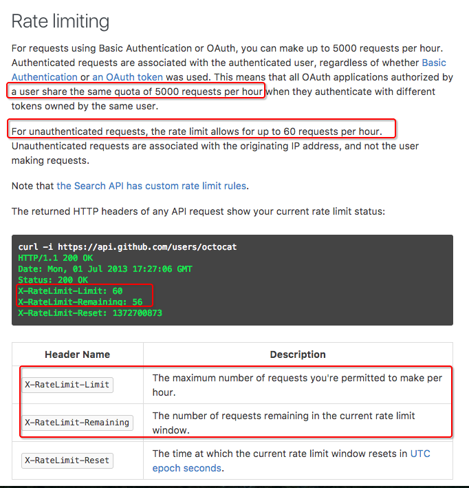
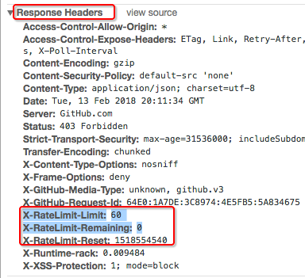

# ❖ Github API 访问次数限制

[参考官方说明](https://developer.github.com/v3/#rate-limiting)

如果没有任何授权直接访问的话，单IP限制每小时60次requests。如果有授权的话，每小时5000次。

通过官方介绍，我们可以在response返回的headers中获取`X-RateLimit-Remaining`和`X-RateLimit`来查看当前剩余的访问次数和当前的每小时限次。

