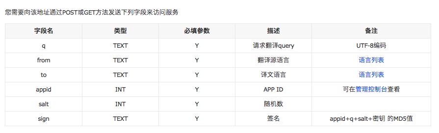
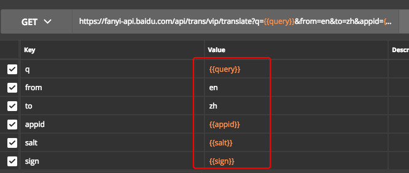
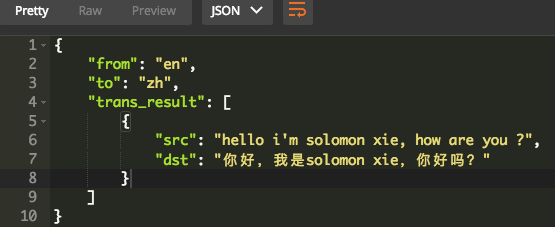

# ❖ 百度翻译API实战

[参考官方文档：定制化翻译API技术文档](http://api.fanyi.baidu.com/api/trans/product/apidoc#cusjoinFile)


## 所需传输参数
百度翻译的API所需的除了需要翻译的内容和指定语言外，比较麻烦的是需要制作3个授权认证相关的参数。




## 正式调用API
API地址：
`https://fanyi-api.baidu.com/api/trans/vip/translate`
千万要看清楚这个地址中的`vip`，而不是官方文档里的`private`。真是个大坑呢。

提交方式：GET 或 POST

参数设置（Params或者Body都可以）：
在Postman中选择`Bulk-edit`，加入以下内容：
```
q:{{query}}
from:en
to:zh
appid:{{appid}}
salt:{{salt}}
sign:{{sign}}
```

选择环境变量，将这几个环境变量加进去：

并且根据自己的内容填进去。

除了填写这些，我们还需要一些自动的脚本来处理数据，因为百度的认证比较麻烦。
在Postman里面选择`Pre-script`，把脚本加进去：
```js
// URL request example: 
// "https://fanyi-api.baidu.com/api/trans/vip/translate?q=apple&from=en&to=zh&appid=2015063000000001&salt=1435660288&sign=f89f9594663708c1605f3d736d01d2d4"

var query = pm.environment.get("query");
var appid = pm.environment.get("appid");
var salt = (new Date).getTime();
var key = pm.environment.get('secret_key');

var sign_string = appid + query + salt + key;
var sign = CryptoJS.MD5(sign_string).toString();

// set encoded query text
pm.environment.set("query", encodeURI(query));
// Set a random number to "salt"
pm.environment.set("salt", salt);
// set hashed "sign" value for authentication
pm.environment.set("sign", sign);

```

然后就可以点击Send发送了。以下是百度翻译返回的内容：


