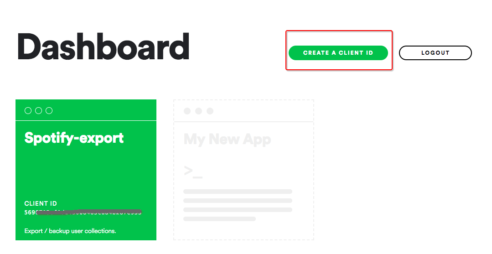
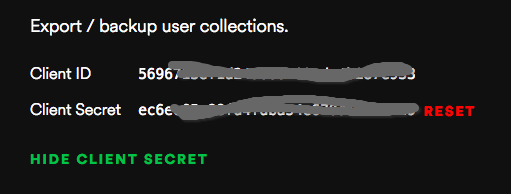
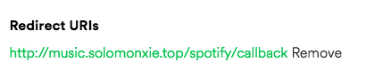
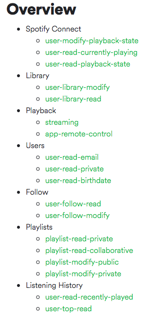
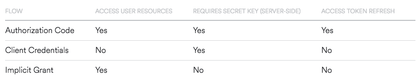
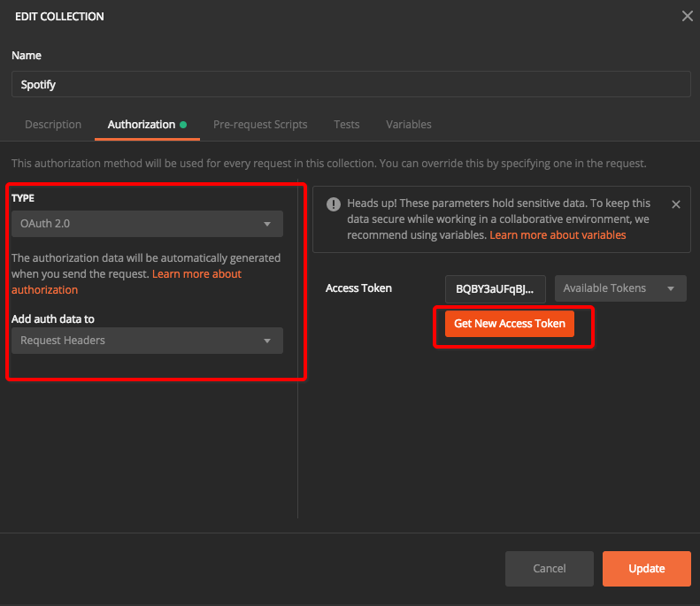
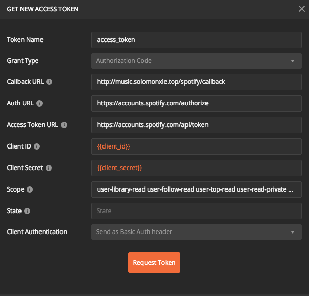
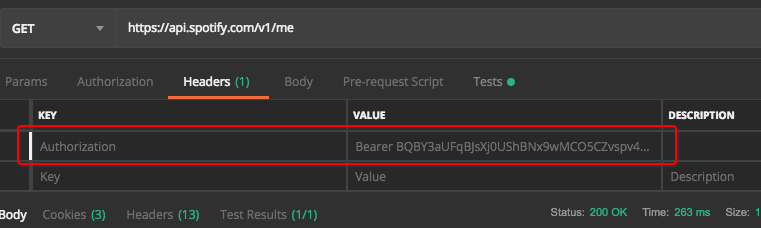

# ❖ 一篇文章玩转世界最强音乐Spotify API

Spotify的API简单分为两个入口：
- 授权入口：https://accounts.spotify.com/api/....
- API入口：https://api.spotify.com/v1/....

其中所有的授权相关验证都通过`授权入口`进行，而所有正常获取数据的API请求都从`API入口`进行。


## Requests Rate Limit 请求限制次数

[参考官网：Authorization Guide](https://developer.spotify.com/documentation/general/guides/authorization-guide/)
[参考官方Github Issues：Getting higher usage rate limits](https://github.com/spotify/web-api/issues/644)

其中只说了不同请求方式的限制次数有不同，但是没写具体有多少：
- Implicit Grant：次数最少，不能刷新token，数量未知。Rate limits for requests are improved but there is no refresh token provided. 
- Client Credentials：次数较多一些，数量未知. The advantage here ... is that a higher rate limit is applied.
- Authorization Code：次数最多，具体数量未知。网友回答：With 400 users, this would work out at one request every 3.6 seconds, which I'm sure wouldn't trigger Spotify's rate limiting policy. 也就是说一个app大约`100 requests/second`，或`6000 requests/minute`。

参考另一篇官网文档：https://developer.spotify.com/web-api/user-guide/
"Rate limiting is applied on an application basis (based on client id), regardless of how many users are using it."
**即无关多少个用户，限制次数只是和每个app挂钩的。**


## Developer 创建开发者身份

前往Spotify开发者网址：https://developer.spotify.com/dashboard



登录后点击`create a client id`，生成一个专用的`client_id`和`client_secret`。





同时必须认真设置`Redirect URIs`，因为日后授权验证时要完全匹配才行。



## Scopes 权限选择

在进行授权申请之前，要先确定这个app需要哪些权限，确定好了再到授权过程中通过参数进行声明。

Spotify对权限进行了详细的分类，全部的权限如下：


[参考官方：Authorization Scopes](https://developer.spotify.com/documentation/general/guides/scopes/)

在之后我们对`/authorize`页面进行GET申请授权时候，需要在URL里加入`scope`参数，里面的值就是我们所选择的一些权限申请。
**每条权限名用` `空格分开**

`只读型`的常用权限有：
- `user-library-read`
- `user-follow-read `
- `user-top-read `
- `user-read-private`
- `playlist-read-private`
- `user-read-playback-state`

`修改型`的常用权限有：
- `user-follow-modify`
- `user-library-modify`
- `playlist-modify-public`
- `playlist-modify-private`

全部组合起来的请求URL是这样的：
```url
https://accounts.spotify.com/authorize?...&...&...&scope=user-library-read user-follow-read user-top-read user-read-private playlist-read-private user-read-playback-state user-follow-modify user-library-modify playlist-modify-public playlist-modify-private
```


## Authentication 授权

授权的最终目的是获取一个名为`access_token`的值，然后用这个`access_token`去获取各种个样的API信息。

[参考官方：Authorization Guide](https://developer.spotify.com/documentation/general/guides/authorization-guide/)

Spotify为了严格区分不同的用途和权限，把这个`access_token`的获取方法分为了三种流程，各自的权限、存活期都不同。

三种流程特点如下：
- `Authorization Code Flow`: 授权码。主要方法，可刷新token。需要弹出网页让用户登录并点击授权。
- `Client Credentials Flow`: app级token。获取非常简单。但不可获取用户资源，也不可刷新。过期需再申请。
- `Implicit Grant Flow`: 临时授权。可获取用户资源，不可刷新。存活期比较短。



### Flow-1: Authorization Code Flow

这是推荐的授权流程，可以获得全部权限，比较安全，且可以刷新token。但是交互步骤多了一点，需要弹出页面手动点击“授权”按钮才行。

具体步骤：
1. 向`/authorize`发送GET请求，包括`client_id`和`redirect_uri`等
2. Spotify弹出页面，用户手动登录并点击允许授权
3. Spotify把页面跳转至自己设定的callback网址，并明文传输一个`Code`码
4. 用`Code`码向`/token`发送POST请求，并在header中包括一个动态生成并base64编码的`Authorization`字符串，格式为`Authorization: Basic *<base64 encoded client_id:client_secret>*`
5. 从Spotify获得`access_token`和`refresh_token`
6. 在`access_token`过期后，用`refresh_token`向`/token`发送POST请求，获得新的`access_token`。


测试过程中，我们是用Postman。好在Postman提供了最简单的方法，一步到位：使用内置Oauth2.0设置。

设置方法是：
- 在Collection上右键点开Edit
- 选择Authentication
- Type选择Oauth 2.0
- Add to根据需求选择把认证添加到headers还是url
- 点击`Get new access token`，添加token flow
- Token name填上url或header中的参数的指定名称，一般为`access_token`。
- Grant type上选择Authentication Code
- 填入所有相关内容，注意callback必须与spotify后台中设置一致
- 点击`request token`
- 然后Postman会弹出一个页面，需要你登录Spotify并点击允许授权。只需这一次，以后每次Postman都会帮你登录了
- 然后Postman就会生成一个全局的`access_token`
- 之后每个页面的Authentication栏，都直接选择`Inherit auth from parent`继承自父级即可自动完成验证。





完成后，每个页面的Header或URL中，都会自动增加一个`access_token`值。




`authentication`的值里，已经默认加上了`Bearer`前缀及后面的base64编码字符串。
注意：同名的参数如果以前存在，则会被覆盖。内置oAuth 2.0的设置是灰色的，在这里不可直接编辑。


### Flow-2: Client Credentials Flow

这种流程只需要用Dashboard后台中的`client_id`和`client_secret`可以直接获取`access_token`。


## SDK

### spotipy
这个不好用，因为功能太少，文档不全，基本的Oauth还要自己手动解决，没什么现成的方法。
```sh
$ pip install spotipy --user
```

### spotify.py

这个也构建不完全，基于async异步，但是很难走通。文档也没说明具体用法。

```sh
$ pip3 install spotify --user
```
