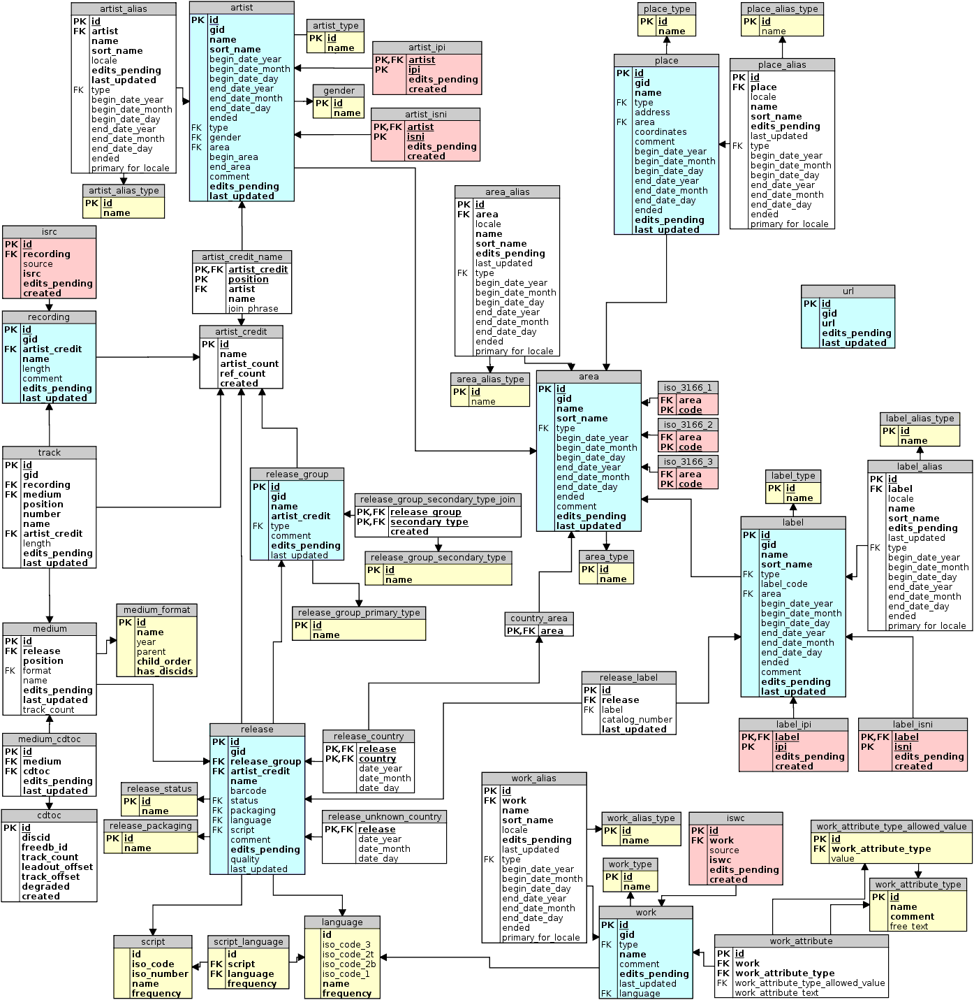

# ❖ 一篇文章玩转全网音乐信息库MusicBrainz API


> **MusicBrainz 没有／没有／没有 复杂的OAuth认证，直接访问即可！**


## MusicBrainz WebAPI

目前Musicbrainz提供两种WebAPI：
- XML Web Service
- JSON Web Service (Beta)


### Rate Limiting

MusicBrainz 的API一般都无用户权限认证，允许任何匿名访问，直接打开浏览器访问即可。

但是，如果为了增加访问限制的数量，官方建议在request请求的头部加上`user-agent`。

[参考：Rate Limiting](https://musicbrainz.org/doc/XML_Web_Service/Rate_Limiting)

格式如下：
```json
User-Agent: <AppName>/<version> ( contact-email )

or 
User-Agent: <AppName>/<version> ( contact-url )

etc.,
User-Agent: MyAwesomeTagger/1.2.0 ( http://myawesometagger.example.com )
User-Agent: MyAwesomeTagger/1.2.0 ( me@example.com )
```

根据`user-agent`的种类，限制情况如下：
- 使用`python-musicbrainz/0.7.3`库访问：限制50次／秒。
- 完全匿名访问：限制50次／秒。
- 其它访问：
    - Source IP address：取决于访问速率，一旦过高，将被完全限制，直到速度降为到1次／秒。
    - Global： 300次／秒。


### MusicBrainz XML API

Musicbrainz的WebAPI是XML格式的。目前v1版本正准备被淘汰，v2版本也很好用。

[参考官方：Development / XML Web Service / Version 2](https://musicbrainz.org/doc/Development/XML_Web_Service/Version_2)

查询格式：
```sh
http://musicbrainz.org/ws/2/<资源>/?query=<属性1>:<值> AND <属性2>:<值>&limit=<显示数>

如，搜索artist：
http://musicbrainz.org/ws/2/artist/?query=name:bigbang%20AND%20country:NO&limit=10

如，搜索album：
http://musicbrainz.org/ws/2/release/?query=name:edendale

如，搜索track：
http://musicbrainz.org/ws/2/recording/?query=name:pristine
```

[具体查询详细参考：Development / XML Web Service / Version 2 / Search](https://musicbrainz.org/doc/Development/XML_Web_Service/Version_2/Search)


### 关于XML解析

Python:
- xmltodict
- lxml
- xpat
- ...

经过试用，目前尚未找到能“正确”解析的工具，总是出现一些问题。


### MusicBrainz JSON API (Beta)

[参考官方：Development/JSON Web Service](https://wiki.musicbrainz.org/Development/JSON_Web_Service)

Musicbrainz提供了一个正在beta开发中的JSON API，要远方便与XML。因为XML的解析实在是太麻烦了。

具体的方法是：在v2版本的API上加上一个`fmt`参数即可。

格式为：`..&fmt=json`

示例：
```
http://musicbrainz.org/ws/2/artist/?query=name:bigbang&fmt=json
```

> 注意：目前JSON API正在开发中，所以是unstable的。


### inc参数

[参考：inc - Development / XML Web Service / Version 2](https://musicbrainz.org/doc/Development/XML_Web_Service/Version_2#inc.3D_arguments_which_affect_subqueries)

当你request API的时候，默认返回的数据很多都是不全的。MusicBrainz可以让你有选择性的增加返回的数据。需要用到的就是url里的`inc`参数。

格式为`...&inc=AAA+BBB+CCC`

示例：
```
http://musicbrainz.org/ws/2/recording/?query=bigbang&inc=artist-credits+isrcs+releases&fmt=json
```


### score属性

在我们请求WebAPI搜索的时候，每个返回的搜索结果都会有一个`score`属性。这个是`匹配度`的值，100分，99分，65分等等。如果搜索的信息完全匹配，则为100。
这个搜索算法，是`Lucene`引擎的算法。

[参考：More information on the “Score” attribute in the search of musicbrainz](https://community.metabrainz.org/t/more-information-on-the-score-attribute-in-the-search-of-musicbrainz/105695)
[参考：Lucene scoring not accurate](https://community.metabrainz.org/t/lucene-scoring-not-accurate/199115)


## MusicBrainz Python SDK

> 注意：目前`python-musicbrainz`项目是调用的v1版本API，显示的数据不是很全。

[参考官方Github：alastair/python-musicbrainzngs](https://github.com/alastair/python-musicbrainzngs)
[参考官方API文档：musicbrainzngs 0.6 documentation »](https://python-musicbrainzngs.readthedocs.io/en/v0.6/api/#getting-data)
[参考官方示例：Usage](https://python-musicbrainzngs.readthedocs.io/en/v0.6/usage/)

安装：
```sh
pip install musicbrainzngs
```

登录：
```sh
import musicbrainzngs as mb

# 登录
mb.auth("用户名", "密码")

# 随便写个app信息
mb.set_useragent("Example music app", "0.1", "http://example.com/music")

# [可选] 指定查询服务器
mb.set_hostname("beta.musicbrainz.org")
```

就是这么简单，没有复杂的Oauth验证。


常用操作：
```py
# 搜索一个artist
artists = mb.search_artists(artist="big bang", type="group", country="Norway")
```


## MusicBrainz Database 数据库下载使用

MusicBrainz的数据库是完全免费公开下载使用的。

[参考官方说明：MusicBrainz Database](https://musicbrainz.org/doc/MusicBrainz_Database)
[参考官方说明：MusicBrainz Database/Download](https://wiki.musicbrainz.org/MusicBrainz_Database/Download)
[参考官方说明：MusicBrainz Database / Schema](https://musicbrainz.org/doc/MusicBrainz_Database/Schema)


MusicBrainz数据库结构图(关系型):



使用方法有很多种：
- Virtual Machine 虚拟机
- JSON文件
- Postgresql数据库


### 安装Postgresql数据库

[参考官方：Database Installation](https://wiki.musicbrainz.org/History:Database_Installation)

下载数据库的方式有http、ftp、rsync等，其中最方便的是http。
下载地址一般为：
http://ftp.musicbrainz.org/pub/musicbrainz/data/fullexport/最新日期/mbdump.tar.bz2

要查看最新日期为什么，可以直接到`http://ftp.musicbrainz.org/pub/musicbrainz/data/fullexport`查看下面的子目录有哪些。

Postgresql数据库下载使用：
```sh
# 下载最新日期的数据库文件 "mbdump.tar.bz2" 大约2.7GB
wget http://ftp.eu.metabrainz.org/pub/musicbrainz/data/fullexport/20181205-001547/mbdump.tar.bz2
tar -xjvf mbdump.tar.bz2
cd mbdump/
mkdir ../finished

# 创建空数据库
createdb -U postgres --owner=postgres --encoding=UNICODE db_musicbrainz

# 登录数据库
psql -U postgres db_musicbrainz
\i admin/sql/CreateTables.sql
BEGIN
\q

# 导入数据
for FILE in * ; do 
    cmd="\\copy $FILE from ./$FILE"
    echo $cmd | psql -U postgres db_musicbrainz && mv $FILE ../finished/
done 
echo `date` Done
cd ..
```
