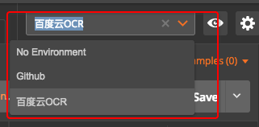
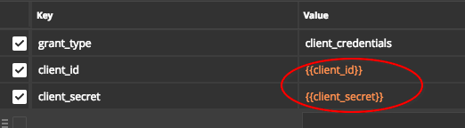
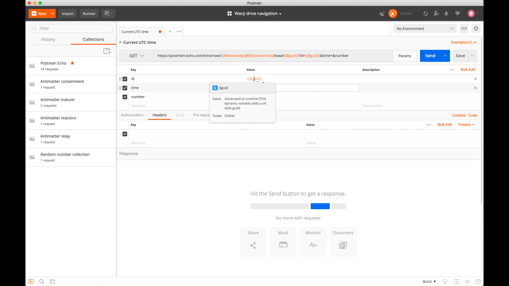

# ❖ Postman变量使用

首先要创建一个`Environment`，然后创建各种`key-value`对儿。
然后在你的项目中，找到右上角的选择框，选择一个`Environment`名称。然后你的项目里就可以使用这个环境里面的变量了。

引用方法：在各种需要填写信息的地方直接写`{{变量名}}`引用它的值。一般打`{{`就会自动弹出可以选择的变量名。

## key-value对中使用的随机数
以下三种变量可以产生不同风格的随机数：
- 整数随机数：`{{randomint}}`，例如：`576`
- 时间随机数：`{{timestamp}}`，例如：`1527920516 `
- GUID风格随机数：`{{guid}}`，例如：`9018e49d-3138-472c-bb62-8f65b4ab7dc1`

## Script脚本中使用的随机数和加密字符串
脚本中使用随机数和加密串就没有那么简单了，需要自己手动写代码生成随机数，常用的如下：
- 生成1000以内的随机数：
`var random = Math.floor(Math.random() * 1000);`
- 生成时间随机数：
`var timestamp = (new Date).getTime();`
- 加密字符串生成MD5：
`var hash = CryptoJS.MD5("hello hello.").toString();`
- 转换为URL编码格式的字符串：
`var url = encodeURI("http://baidu.com/?q=hello i'm solomon.");`
- 字符串转base64编码：
``
