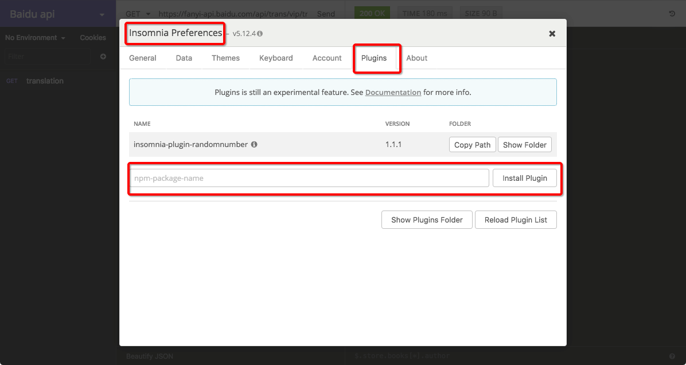

# Insomnia 客户端添加插件
Insomnia是带我入门API且我认为最棒最棒的入门工具，正如其标语: `Debug APIs like a human, not a robot`. 不过在接触更多的API时，会发现有些不便利，比如百度翻译api的权限验证需要各种随机码和MD5，github的api需要文件的base64等。Insomnia本身暂时不具备这么多功能。所以需要给它安装插件。
安装方法很简单，不需要在命令行通过npm安装插件，直接在界面GUI里输入插件名即可下载安装。

## 常用插件
- `insomnia-plugin-randomnumber` 生成随机数，只要在`enviroment`中输入random就会自动提示，并调用随机函数。

