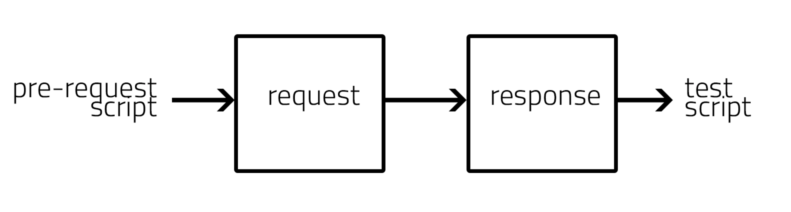
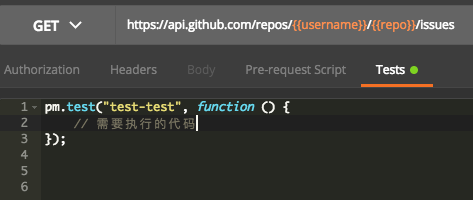
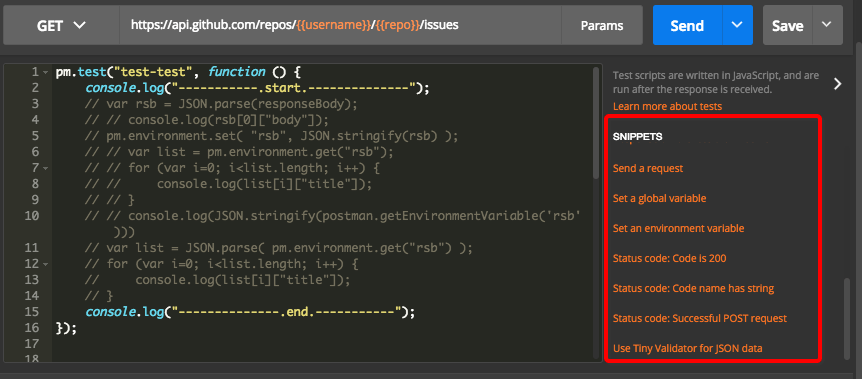
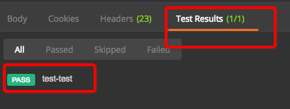
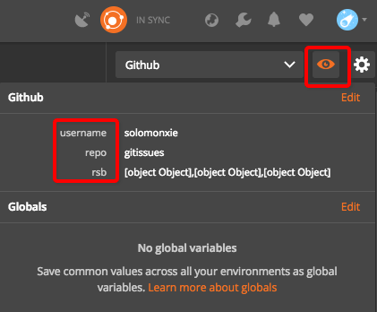
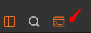
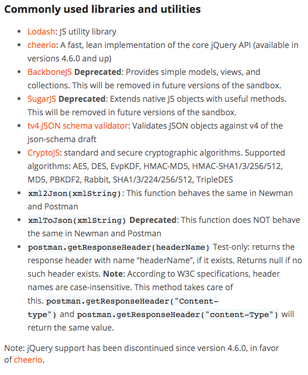

# ❖ Postman Script 脚本语法总结

> Postman的强大之处在于其允许在对某一个request访问的之前和之后分别运行自定义的一段Javascript脚本，这样直接就完成了一个`chain request`的效果，可以将数条request连结成一个流程完成一体化测试。这在很多的API操作中都是极其有用的，所以这里有必要总结一些常用语句。

[参考Postman官方：Intro to scripts](https://learning.getpostman.com/docs/postman/scripts/intro_to_scripts/)


## Script workflow 脚本执行流程


- `pre-request`脚本，是在对API进行请求之前的脚本，一般用于动态生成参数、JSON数据包、链接地址等。
- `test`脚本，其实更应该叫`post-request`，实在完成API访问并得到其response回应之后运行的脚本，一般用于获取response的内容，用于之后对于别的资源的请求，如获取页面标题和内容等。


## Requirements 运行脚本要求

需要注意，`pre-request`脚本，在里面直接写代码就可以了，但是`test`脚本需要在某个指定的函数`pm.test(...)`中执行才会被识别，且作为`test`脚本运行。如下图：

`pm.test()`中第一个参数是测试描述(会在测试结果栏显示，应和其它测试描述做以区分)，第二个参数是一个函数，具体执行代码都在这个函数中运行。
另外，`pm`对象是Postman的主要对象，所有的内置函数，数据调用等，都需要通过它来实现。


## Code Snippets 常用语句

一般会在脚本编写栏的右边都会有常用语句片段，点击以下就会出来代码，但是一开始不太了解的话点出来其实也看不懂。如下图：


官方文档解释的各种函数调用链接在这里：[Postman Sandbox](https://www.getpostman.com/docs/postman/scripts/postman_sandbox)

以下是我自己总结的常用代码片段：
```javascript
// 获取response返回内容
var rsb = responseBody; // 是字符串格式

// 获取环境变量
var v = pm.environment.get("变量名称");

// 设置环境变量 只能存储字符串，如果是对象的话则无法在下次运行时获取到内容
// 如需要存储JSON数据，可以用JSON.stringify(..)存储，再用JSON.parse(..)转化为对象使用
pm.environment.set("变量名称", 变量内容);

// 清除某个环境变量
pm.environment.unset("环境变量名");

// 获取全局变量和普通变量
var gb = pm.globals.get("全局变量名");
var nm = pm.variables.get("普通变量名");

// Javascript 获取变量类型
console.log( typeof pm.enviroment );
```


## Pre-request Script 预处理脚本

`Pre-request script`是在request之前准备request信息用的脚本。

[参考Postman官方：Pre-request scripts](https://learning.getpostman.com/docs/postman/scripts/pre_request_scripts/)

常用的准备工作有：
- 读取环境变量，再放到request body或headers中。
- 拼接组合提交request请求所需要的参数，比如authentication code。

常用的语句如下：
```js
// 获取环境变量
var v = pm.environment.get("变量名称");

// 设置环境变量 只能存储字符串，如果是对象的话则无法在下次运行时获取到内容
// 如需要存储JSON数据，可以用JSON.stringify(..)存储，再用JSON.parse(..)转化为对象使用
pm.environment.set("变量名称", 变量内容);
```


## Test Script 测试脚本

测试脚本是在request之后，对Response的返回值进行下一步处理的脚本。

[参考Postman官方：Test scripts](https://learning.getpostman.com/docs/postman/scripts/test_scripts/)
[参考Postman官方：Test examples](https://learning.getpostman.com/docs/postman/scripts/test_examples/)


常用的处理有：
- 读取response回复的数据，存为环境变量
- 根据response回复的状态成功与否，判断下一步做什么

常用的语句如下：
```js
// 获取response headers中某一个值
ctype = postman.getResponseHeader("Content-Type");

// 获取response body的全部内容
text = pm.response.text();

// 获取response返回的全部JSON
json_data = pm.response.json();

// 获取json中某一个值，比如name的值：
myName = json_data.name;
```


## Test Result 测试结果

除了上面的具体功能代码外，经常还需要返回一个结果，告诉Postman这个测试结果是Pass还是Fail，默认是pass。

这里返回值就不是简单的return语句可以，必须要通过Postman自带的对象或方法才可以，一般是通过`pm.expect()`或`tests[]`这两个地方返回测试结果。


完整的测试示范：
```js
// 测试response的状态是否是200成功：
pm.test("Status code is 200", function () {
    pm.response.to.have.status(200);
});
```


这些方法名看起来都很容易理解，一般都会叫`pm.expect()`或`.to.be()`或`.to.have()`这样的，字面意思就是期待什么或要求它必须是什么或必须有什么，才能通过测试。
另外，同样的测试结果，实际上还有更简单的写法，即不通过`pm`对象，而是内置`tests`对象。

常用操作如下：
```js
# 反应时间必须少于200毫秒
tests["Response time is less than 200ms"] = responseTime < 200;

# 判断反应代号是否等于某一个指定的代号
tests["Status code name has string"] = responseCode.name.has("Created");
```

看这个用法，猜测`tests`是一个JSON格式的对象，`tests[...]`括号内的字符串是测试的描述， `=`后面是判断语句，然后将True或False赋予为`tests[..]`的值，然后postman轮训所有`tests`对象里的参数，并返回pass与否的结果。


这里是官方总结的常用测试脚本方法：[Test examples](https://www.getpostman.com/docs/postman/scripts/test_examples)

以下是我总结的常用的返回测试结果的内置函数：

```javascript
# “期待”返回结果必须包含某一段内容
pm.expect(从response里获取的字符串).to.include("必须包含的内容");

# 返回body值必须完全等于某一段内容
pm.response.to.have.body("必须等于的内容");

# 反应时间必须少于200毫秒
pm.expect(pm.response.responseTime).to.be.below(200);

# 必须返回某一个状态 如"Created"
pm.response.to.have.status("状态名");

```




## Debugging 脚本调试

如果要看已经设置的Enviroment变量的话，可以点开右上方小眼睛看到，如下图，我设置了3个环境变量：



调试时要打印的话，一般都是用`console.log(...)`，这样就能在console中看到：
- 如果你的Postman是Chrome app的话，直接在chrome浏览器的开发者工具里调试就行。
- 如果是Mac等桌面软件，则需要打开内置的console才能看到调试信息。
位置在左下角，如下图：



## Postman Sandbox

Postman的Sandbox是Postman内部默认引入的第三方JS库。

[参考：Postman Sandbox 官方脚本可引用库说明](https://www.getpostman.com/docs/v6/postman/scripts/postman_sandbox)
[参考：Postman Sandbox API 官方引用的脚本库详解](https://www.getpostman.com/docs/v6/postman/scripts/postman_sandbox_api_reference)

Sandbox引用的第三方库有：




生成MD5字符串：
```js
var hashed = CryptoJS.MD5("待加密的字符串");
```

文件转base64字符串：
```js
s = 'Hello';
// 先转化成UTF-8编码的字符串
utf8 = CryptoJS.enc.Utf8.parse( s );
// 用CryptoJS第三方库(Postman已经内置了)进行编码
b64 = CryptoJS.enc.Base64.stringify(utf8)

console.log(b64);
// aGVsbG8=
```


## Postman SDK

不同于Sandbox，这是Postman内部较高级的SDK，可以引用一些方便的方法。

[参考官方网址：Tutorial: Postman SDK Concepts](https://www.postmanlabs.com/postman-collection/tutorial-concepts.html)

URL转换成JSON格式，并获取指定的参数值：
```js
var sdk = require('postman-collection');
query = ( new sdk.Url(callback) ).toJSON().query;

for (var i in query) {
    console.log(query[i].key +": "+ query[i].value);
}
```
