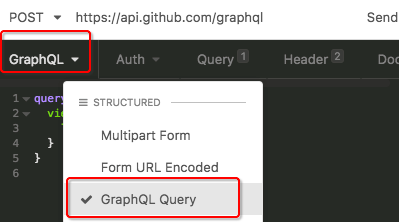
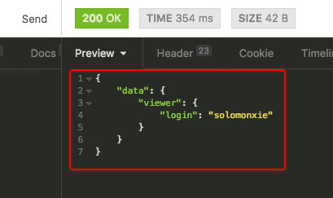
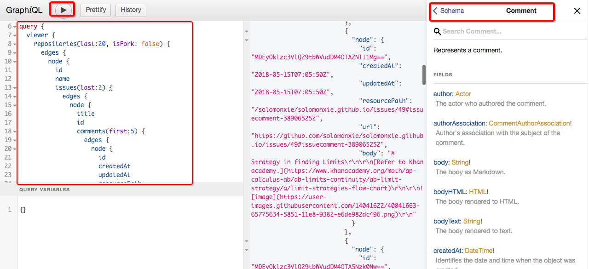
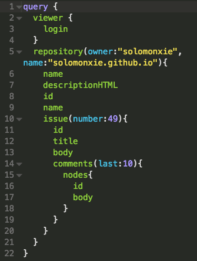

# ❖ 初探新一代API的Github API v4: GraphQL [DRAFT]

`GraphQL`势不可挡，有着即将取代REST的API架构。主要好处就是“你要什么，api就给你什么。而不是你要不要都给你返回一大堆没用的。”

而且：GraphQL只需要一个网址URL！
```
https://api.github.com/graphql
```

不像REST，你需要各种各有的URL去申请不同的内容。GraphQL一个URL全够了。
而且一般不是很复杂的情况下，你几乎只要request一次这个地址，就能拿到你全部需要的数据了（能按照你的需求返回给你各种嵌套的、格式化的数据）

> 网上看了很多文章解释之后发现还是什么都没懂。所以这篇分享不打算按照常规路线，先用一大堆结构图、语法给你弄懵。这里我想先让它运作起来，有个"Hello world"，然后再去深究背后的逻辑和语法。

## 初试GraphQL

> 要说去了解一个API，最好的方式就是用`Postman`或`Insomnia`这种REST客户端去连接玩耍了，不需要任何编程，只是手动点一点就ok。

”有意思“的是，因为GraphQL太新潮，这两大客户端对它的支持各不相同，使用的参数、格式也大相径庭。
下面通过最简单的案例总结一下。

### Insomnia 访问Github GraphQL 的案例

Insomnia对GraphQL的支持相当好，可以说已经领先别人一步。
以下为操作步骤：
- 新建request， 设置为POST方式访问`https://api.github.com/graphql`
- 申请授权认证：
Github的API v4不能陌生访问，必须使用自己的账号申请一个token密码串，然后在每次连接API时使用。
操作很简单，登录Github后，找到`Settings -> Developer settings -> Personal access tokens -> Generate new token`，生成一个新的token授权密码串，复制保存到本地备份。
- 添加授权认证：
在Insomnia软件里，有两种授权方式都可以达到同样认证效果：明文的Query参数里设置（即在url后面加上参数），或者Header表头里设置。
Query里设置的话，格式为：`?access_token=xxxxxxxxxxx`
Header里设置的话，格式是：名称为`Authorization`，值为`token xxxxxxxxxx`。
- 在栏目里面的Body位置选择`GraphQL`格式：

- 输入Github指定格式的`查询语句`（看似JSON格式实则不是）：
```graphql
query {
  viewer {
    login
  }
}
```
- 点击Send发送请求，如果一切正常，则会得到查询的返回值：



### Postman访问GraphQL失败

不像Insomnia，Postman暂时没有支持GraphQL的选项，但是可以通过类似的操作达到一样的效果。流程是一样的，只是每个地方设置格式都不同，这也是我不断尝试才找到的总结方案（可惜网上相关教程太少）。

这里只说不同的地方吧：
- 授权比Insomnia多一种方式，可以在`Authorization`栏目里面直接选`OAuth 2.0`然后输入token密码串。
- 最重要的是Body部分，`查询语句`完全不能使用Github指定的格式。只能选择Body格式为`Raw -> JSON(application/json)`。然后加上`查询语句`，格式如下**（必须完全符合JSON语法）**：
```json
{ 
  "query": "query {viewer { login } }"
}
```


## GitHub GraphQL Explorer

这个是Github制作的`网页练习机`，免去了一切授权等处理，让你只专注于`查询语句`的调用练习。
每次点击运行，都会实时返回对应的数据。
如果记不住的、不懂的，还可以点击旁边的`Docs`，会显示出一个搜索框，显示你需要的内容的文档。


[GraphQL API Explorer | GitHub Developer Guide](https://developer.github.com/v4/explorer/)



## 常用查询结构

下面展示一些我测试过的查询结构，希望能起到帮助作用。
为了增强阅读性，节省文字长度，返回值就先不粘上来了。而且返回值几乎就是查询语句的结构，没什么特别新鲜的。

### 查询指定的repo中的issues和comments

其中指定了某一个repo（通过owner和name指定），也指定了某一条issue（通过number指定），并要求返回最近的10条comments。



