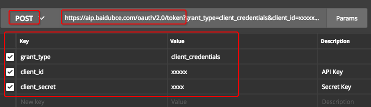
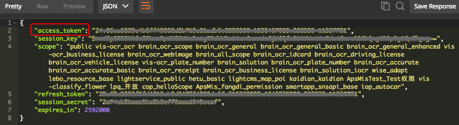
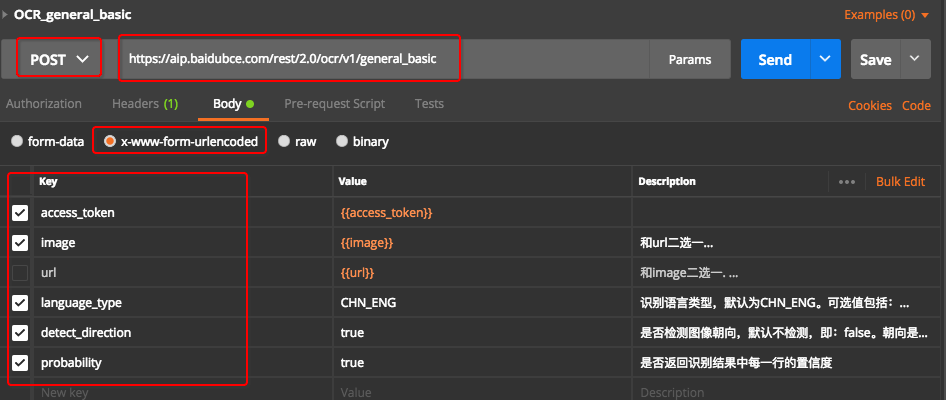
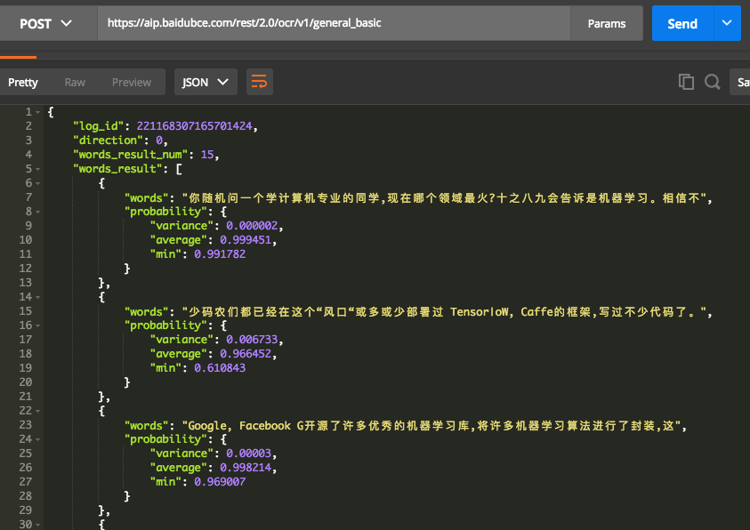
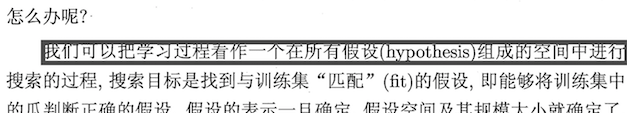

# ❖ 一篇文章搞定百度OCR图片文字识别API

研究百度OCR的API，主要是向做对扫描版的各种PDF进行文字识别并转Word文档的需求。

这里用Postman客户端进行测试和演示。因为Postman是对各种API操作的最佳入门方式。一旦在Postman里实现了正确的调用，剩下的就只是一键生成代码，和一些细节的修改了。

[参考百度云官方文档：文字识别API参考](https://cloud.baidu.com/doc/OCR/OCR-API.html)
[下载官方文档PDF：OCR.zh.pdf](https://github.com/solomonxie/solomonxie.github.io/files/2064546/OCR.zh.pdf)


## 授权字符串 Access Token

`Token字符串`永远是你使用别人API的第一步，简单说，就是只有你自己知道的密码，在你每次向服务器发送的请求里面加上这个字符串，就相当于完成了一次登录。

> 如果没有Token授权认证，API的访问可能会像浏览网页一样简单。

`Access Token`一般是调用API最重要也最麻烦的地方了：每个公司都不一样，各种设置安全问题让你的Token复杂化。而百度云的Token，真的是麻烦到一定地步了。

[参考：百度API的鉴权认证机制](http://ai.baidu.com/docs#/Auth/top) (建议你不要参考，因为它的流程图会先把你镇住的)

简单说，获取百度云token字符串的主要流程就是：
- 创建一个应用，获得只有自己知道的id和密码
- 用POST方式把id和密码发给百度的一个链接：
`https://aip.baidubce.com/oauth/2.0/token`
- 其中，需要你向这个地址传送三个参数：
    - `grant_type = client_credentials` 这个是固定的
    - `client_id = xxx` 这个是你在百度云管理后台创建OCR应用的时候，那个应用的`API Key`
    - `client_secret = xxx` 这个是你的应用的`Secret Key`
- 等待服务器返还给你一个包含token字符串的数据
- 记住这个token字符串，并用来访问每一次的API

来看看怎么利用Postman操作，如下图所示：


填好以后点击Send发送，就会获得一个JSON数据，如下图：


然后你用你的程序(Python, PHP, Node.js等，随便)，获取这个JSON中的`access_token`，
即可用到正式的API请求中，做为授权认证。


## 正式调用API： 以"通用文字识别"为例

API链接：`https://aip.baidubce.com/rest/2.0/ocr/v1/general_basic`

提交方式：`POST`

调用方式有两种：
- 方式一：直接在URL填写信息
直接把API所需的认证信息放在URL里是最简单最方便的。
- ~方式二：Headers填写信息方式~
建议忽略这种方式，需要填写很多request的标准headers，太麻烦。

Headers设置：
- `Content-Type = application/x-www-form-urlencoded`
只要填这一项就够了。

Body数据传送的各项参数：
- `access_token = xxx` 把之前获取到的token字符串填到这里来
- `image = xxx` 把图片转成base64字符串填到这里，不需要开头的`data:image/png;base64,`
- `url = xxx` 也可以不用传图片而是传一个图片的链接。**但是百年无效，不要用！**
- `language_type  = CHN_ENG` 识别语言类型。默认中英。

Body的数据如图所示：



然后就可以点Send发送请求了。
成功后，可以得到百度云返回的一个JSON数据，类似下图：


返回的是一行一行的识别字符。百度云的识别率是相当高的，几乎100%吧。毕竟是国内本土的机器训练出来的。

## 关于坐标问题

因为一般情况下我们会想要去用OCR，肯定是想将文字还原回原来的位置。那么一般来讲，位置信息就是很必要的了。
利用百度OCR的位置信息版，我们可以获得非常详细的位置信息，以下为从中摘取的一句话的全部信息：
```json
{
"words": "我们可以把学习过程看作一个在所有假设 hypothesis)组成的空间中进行",
"vertexes_location": [{"y": 739, "x": 1615 }, {"y": 739, "x": 4225 }, {"y": 831, "x": 4225 }, {"y": 831, "x": 1615 } ],
"probability": {
    "variance": 0.000506,
    "average": 0.993495,
    "min": 0.881102
},
"min_finegrained_vertexes_location": [{"y": 739, "x": 1615 }, {"y": 739, "x": 4225 }, {"y": 831, "x": 4225 }, {"y": 831, "x": 1615 } ],
"finegrained_vertexes_location": [{"y": 739, "x": 1615 }, {"y": 739, "x": 1710 }, {"y": 739, "x": 1805 }, {"y": 739, "x": 1899 }, {"y": 739, "x": 1991 }, {"y": 739, "x": 2086 }, {"y": 739, "x": 2181 }, {"y": 739, "x": 2275 }, {"y": 739, "x": 2367 }, {"y": 739, "x": 2462 }, {"y": 739, "x": 2557 }, {"y": 739, "x": 2651 }, {"y": 739, "x": 2746 }, {"y": 739, "x": 2838 }, {"y": 739, "x": 2933 }, {"y": 739, "x": 3027 }, {"y": 739, "x": 3122 }, {"y": 739, "x": 3214 }, {"y": 739, "x": 3309 }, {"y": 739, "x": 3403 }, {"y": 739, "x": 3498 }, {"y": 739, "x": 3590 }, {"y": 739, "x": 3685 }, {"y": 739, "x": 3779 }, {"y": 739, "x": 3874 }, {"y": 739, "x": 3966 }, {"y": 739, "x": 4061 }, {"y": 739, "x": 4155 }, {"y": 739, "x": 4225 }, {"y": 786, "x": 4225 }, {"y": 831, "x": 4225 }, {"y": 831, "x": 4130 }, {"y": 831, "x": 4036 }, {"y": 831, "x": 3941 }, {"y": 831, "x": 3849 }, {"y": 831, "x": 3754 }, {"y": 831, "x": 3660 }, {"y": 831, "x": 3565 }, {"y": 831, "x": 3473 }, {"y": 831, "x": 3378 }, {"y": 831, "x": 3284 }, {"y": 831, "x": 3189 }, {"y": 831, "x": 3097 }, {"y": 831, "x": 3002 }, {"y": 831, "x": 2908 }, {"y": 831, "x": 2813 }, {"y": 831, "x": 2721 }, {"y": 831, "x": 2626 }, {"y": 831, "x": 2532 }, {"y": 831, "x": 2437 }, {"y": 831, "x": 2345 }, {"y": 831, "x": 2250 }, {"y": 831, "x": 2156 }, {"y": 831, "x": 2061 }, {"y": 831, "x": 1969 }, {"y": 831, "x": 1874 }, {"y": 831, "x": 1780 }, {"y": 831, "x": 1685 }, {"y": 831, "x": 1615 }, {"y": 786, "x": 1615 } ],
"location": {"width": 2611, "top": 739, "left": 1615, "height": 97 }
},
```

经过测试，这些位置是`像素点`位置。其中：
- `vertexes_location`，以这整行为一个Box的4顶点坐标
- `min_finegrained_vertexes_location`，和旋转有关的坐标
- `finegrained_vertexes_location`，非常详细，以每一个字为一个Box的4顶点坐标
- `location`，以整行为一个Box的绘制数据：起点、宽、高。

为了证明，我利用Python根据它提供的位置信息框住它所对应的文字，真的是非常准确，如下图：
> 


## API常用地址

以下是百度云的OCR常用API地址，每个API所需的参数都差不多，略有不同。所有的API和地址以及详细所需的参数，参考官方文档，很简单。一个弄明白了就其他的都明白了。

API | 请求地址 | 调用量限制
-- | -- | --
通用文字识别 | https://aip.baidubce.com/rest/2.0/ocr/v1/general_basic | 50000次/天免费
通用文字识别（含位置信息版） | https://aip.baidubce.com/rest/2.0/ocr/v1/general | 500次/天免费
通用文字识别（高精度版） | https://aip.baidubce.com/rest/2.0/ocr/v1/accurate_basic | 500次/天免费
通用文字识别（高精度含位置版） | https://aip.baidubce.com/rest/2.0/ocr/v1/accurate | 50次/天免费
网络图片文字识别 | https://aip.baidubce.com/rest/2.0/ocr/v1/webimage | 500次/天免费

