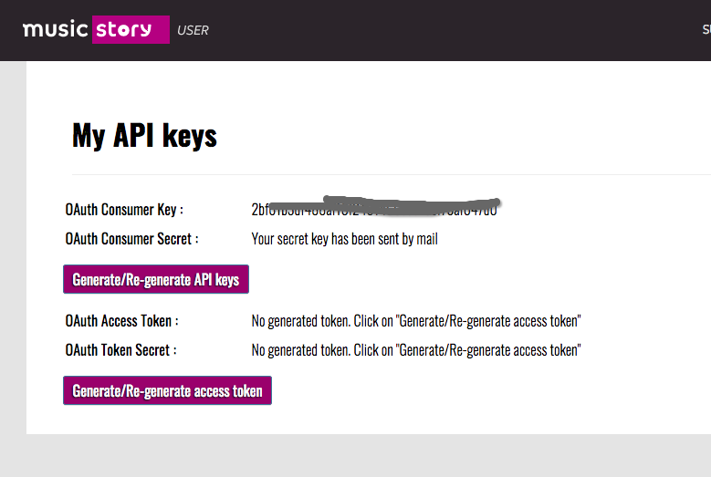
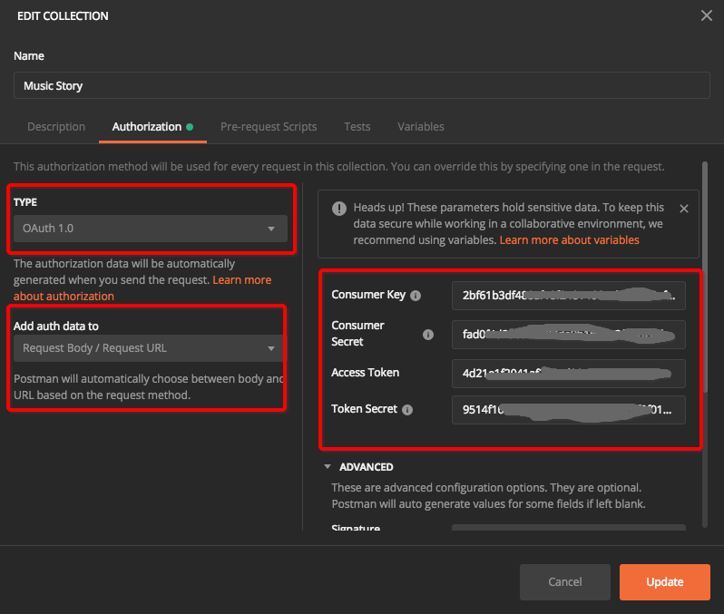

# ❖ 音乐服务商Music Story API操作全程


参考官网：http://developers.music-story.com/developers

`Music Story` 是一个非开源收费版的类似`MusicBrainz`的音乐库。它的最大优点是能提供各种单曲、专辑、歌手的`Connector`，即显示资源在各种平台上的链接。比如有一首歌，它能提供API告诉你它在Youtube、Spotify、MusicBrainz等平台的资源链接。
有了这个`Connector`后，我们就可以做很多有趣的事情。

但是这个API是半收费的，即免费版用户每个月只能request 2000次。显然有点少。所以我只打算用它的`connector`，而其它所有信息还是以免费的`MusicBrainz`为主。


## 注册开发者身份

注册开发者身份：http://user.music-story.com/

这个API的注册极其简单，注册个用户，就能立马得到oAuth 1.0的两套key-token密钥对。

显示token的地址为：http://user.music-story.com/contrat

第一个`Consumer`密钥对，密码自动会发到邮箱。第二个`Access`密钥对，要手动点一下生成才行。
全部生成好，最好复制到本地文本里面，以供下次使用。




## 授权验证

Music Story采用Oauth 1.0验证，需要这些步骤：
- 通过两套secret密钥向`http://api.music-story.com/oauth/request_token`提交授权申请
- 获取`oauth_signature`值
- 每次查询API时，都在URL中加入`&oauth_token=<VOTRE TOKEN D'ACCES>&oauth_signature=<SIGNATURE OAUTH>`这两个参数即可。

在Postman中测试的话很方便，无需复杂操作即可完成。在Authentication页面选择Oauth 1.0方式授权，填入密钥信息即可。




## 读取API

按歌名搜索一首歌：
```
http://api.music-story.com/en/track/search?title=now is not a good time
```
结果会返回它的ID等信息。不包括详细信息。


比如一首歌的id是`22739747299518299`，那么搜索它的信息：
```
http://api.music-story.com/en/track/22739747299518299
```

搜索一首歌的conenctor，比如youtube：
```
http://api.music-story.com/en/track/22739747299518299/youtube
```

同理，albums和Artists也都是这么操作。
