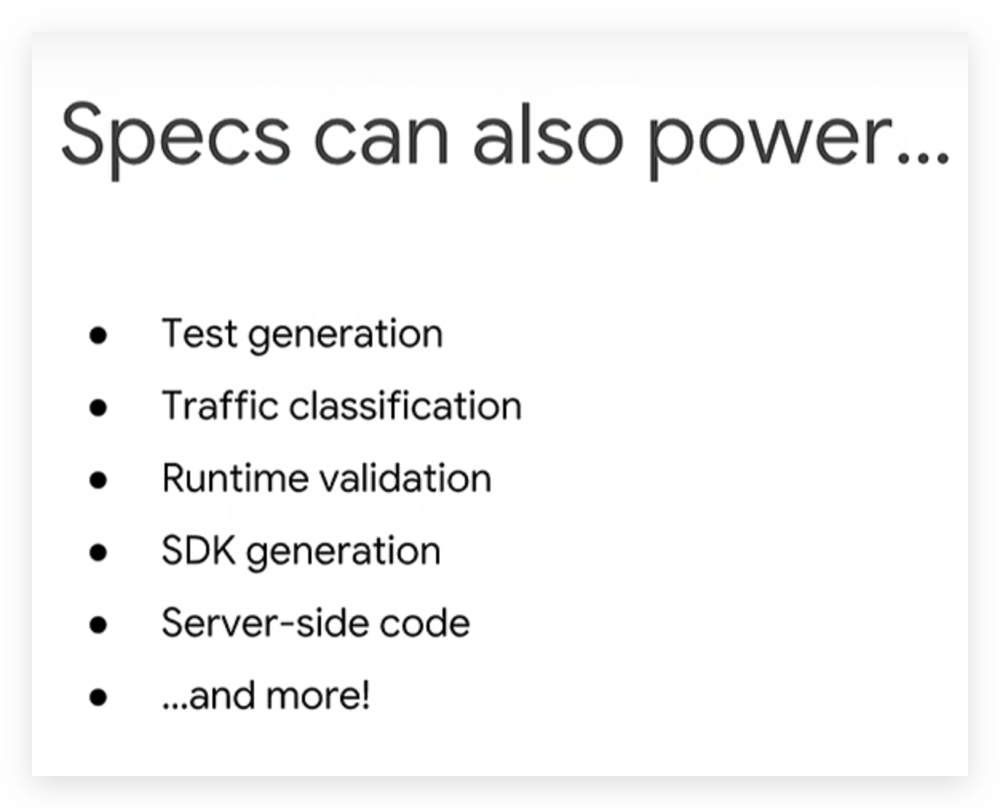
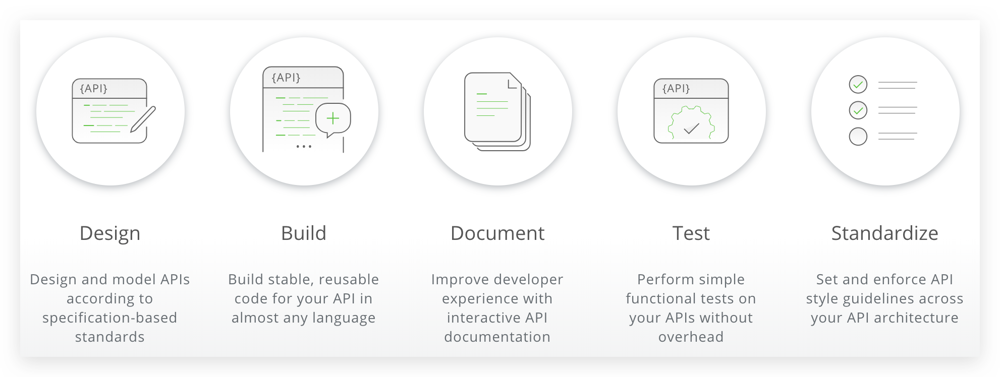
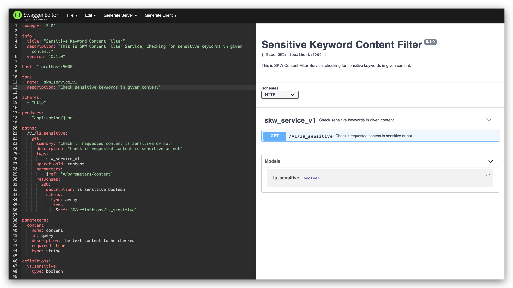
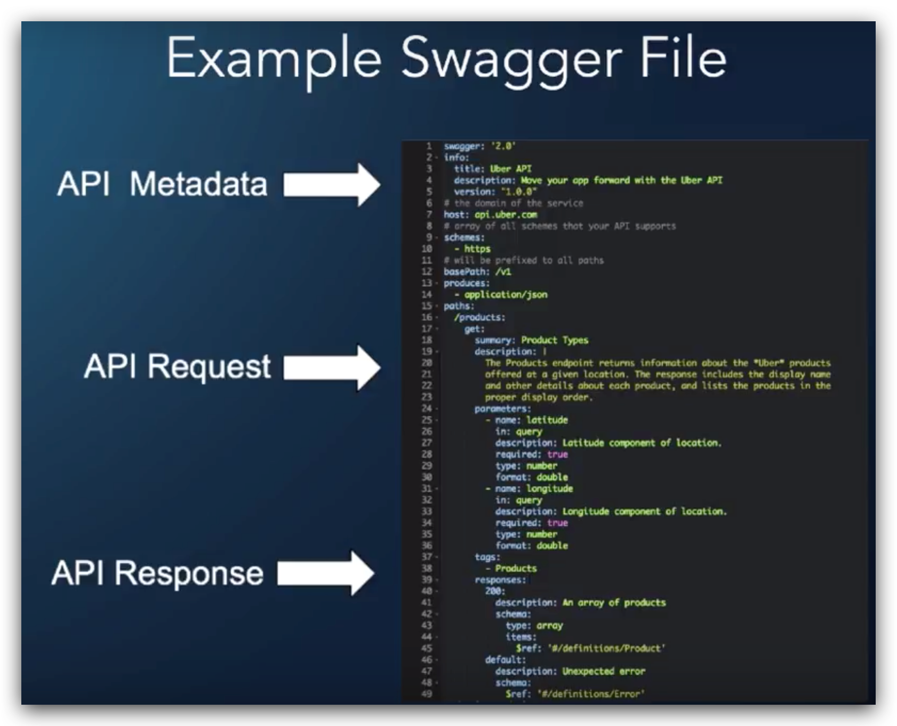

# ❖ Swagger Like A Boss [DRAFT]

[Refer to Youtube: API Gateway: Getting started with Swagger](https://www.youtube.com/watch?v=K4ftoyg31qs)
[Refer to Youtube: Better API Design with OpenAPI](https://www.youtube.com/watch?v=uBs6dfUgxcI)

## What is Swagger

Swagger is a API Definition Language. Yeah, you heard it right, it's a **language**, or more specifically it's the **implementation** of that API Definition Language, which the language itself actually is called the `OpenAPI`.

`OpenAPI` is a generally recognized _protocol_ or _standard_ that more and more organizations in the world apply it for their API architecture just like`REST` or `OAuth`. Swagger or OpenAPI is like a _blueprint_ of a building and you don't want to construct a building without a blueprint.
So basically `OpenAPI = Swagger`, you can say either of them interchangabily.

As an API framework driven by open-source community, `Swagger` becomes the most common implementation of that protocol OpenAPI, just like Django-Rest to REST protocol. Which tells you that you don't really want to learn any other protocols for most of the case and it won't go so wrong if you just stick with it.

In the framework, Swagger provides a bunch of tools for us to generate APIs by simply defining a yaml file:
- Swagger Codegen: It's tool to do `swagger to code` for you, so that you don't need to write any code.
- Swagger Editor
- Swagger UI

We write a `swagger.yaml`, and the java based tool `swagger-codegen` will generate a whole API _Server Code Base_ & _API client_ for us in multiple language: Python, Ruby, Rust and such.


## What can Swagger do?




## How to build API with Swagger Tools

> "The Best APIs are Built with Swagger Tools." - The banner of Swagger official site _swagger.io_

To build API for our product, we need to go through these stages: `Design`, `Build`, `Documentation`, `Test` and `Standardize`. And Swagger provides tools for all the stages above.



Let's go through how Swagger will help with those stages:
- `Design`: The online `Swagger Editor` is really convenient for composing `swagger.yaml` which shows you in real-time the API and syntax errors by the time you type.
- `Build`: Once you got the well defined `swagger.yaml`, `swagger-codegen` will generate a whole `server code base`, say in Python, for you merely based on the API definition you just write. And with no extra effor you can then open a browser and visit the APIs (but before you implement each API's response, that'll be an empty page with `200 OK.` response code.
- `Documentation`: The first common use of Swagger is to generate a whole explicit document for your API structure with ease. This saves days or weeks of efforts of engineers.
- `Test`
- `Standardize`


## Swagger Syntax (Swagger Spec/Specification)

> "Every good API starts from a `swagger.yaml`."

By far you've probably got some basic about what is Swagger and what tools it provides, and you got the idea that building API might only need you to write a simple text file called `swagger.yaml`. Or officially, you want to call that file the `Swagger Specs`.
Before composing definitions in that file, we'd like to know some basic syntax.

[Refer to: Swagger Specification](https://swagger.io/docs/specification/basic-structure/)

For manually composing _swagger specs_, you might want to do the composing on [Swagger Editor (Online)](https://editor.swagger.io/) which gives you the instant result on your API definitions in a clear visual mode and shows you all suggestions or syntax errors if they exist.




### The Structure of Swagger definitions [DRAFT]

In the `swagger.yaml`, there're 3 major sections:
- API Metadata
- API Request
- API Response




### Definition: API Metadata [DRAFT]

```yaml


```


### Definition: API Request


```yaml


```

- `tags` regards to `filename`
- `operationId` regards to `function name`


### Definition: API Response


```yaml


```


## Document Driven Development (DDD) [DRAFT]

Unlike usual API development process, say _Code-driven Development_ that write all necessary code first then write documents to explain the code. The thing is your code is changing all over the time and anytime you change it, you need to update the documents as well, which is tedious and time consuming, sometimes can be exhausting.

> Coders hates reading documents and writing documents.

_Document Driven Development_ brings a better approach for building a complex API infrastructure.
"DDD" lets the PM or manager to write the "documents" first before any code is written. They can make a draft, review, alter and 


## Can you do both: Swagger-codegen and Flask? [DRAFT]

Although there's a `Flask-RESTful`framework for you to build a REST API easily, but `Swagger-codegen` can generate an API server with any coding. But what if we want to integrate Swagger definitions in our Flask framework?

"Connexion is a framework on top of Flask to automagically handle your REST API requests based on Swagger 2.0 Specification files in YAML."
