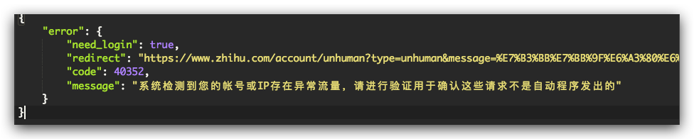
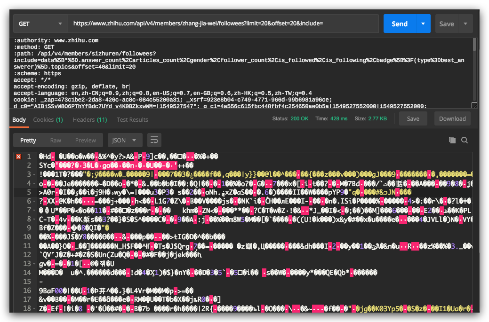

# 知乎用户爬取
`Feb 21, 2019`

## API

入口:
- 用户信息: `https://www.zhihu.com/api/v4/members/{username}`
- 用户粉丝: `https://www.zhihu.com/api/v4/members/{username}/followers`
- 用户关注: `https://www.zhihu.com/api/v4/members/{username}/followees`

分页:
- `limit`: 20 items/page
- `offset`: starts from 0

URL附加参数(`include`-> 可选额外信息)
- 用户信息可以includes: `locations,employments,gender,educations,business,voteup_count,thanked_Count,follower_count,following_count,cover_url,following_topic_count,following_question_count,following_favlists_count,following_columns_count,avatar_hue,answer_count,articles_count,pins_count,question_count,columns_count,commercial_question_count,favorite_count,favorited_count,logs_count,included_answers_count,included_articles_count,included_text,message_thread_token,account_status,is_active,is_bind_phone,is_force_renamed,is_bind_sina,is_privacy_protected,sina_weibo_url,sina_weibo_name,show_sina_weibo,is_blocking,is_blocked,is_following,is_followed,is_org_createpin_white_user,mutual_followees_count,vote_to_count,vote_from_count,thank_to_count,thank_from_count,thanked_count,description,hosted_live_count,participated_live_count,allow_message,industry_category,org_name,org_homepage,badge[?(type=best_answerer)].topics`
- 用户粉丝可以includes: `answer_count,articles_count,gender,follower_count,is_followed,is_following,badge[?(type=best_answerer)].topics`
- 用户关注可以includes: `answer_count,articles_count,gender,follower_count,is_followed,is_following,badge[?(type=best_answerer)].topics`

## LIMIT 爬取限制

目前通过测试得出，知乎会对IP进行每小时内访问量进行限制。

一旦被封锁IP，那么会返回`403`状态，并且发出提示：

如果把登录后所有的cookies都复制下来，加到爬虫的headers里面，那么结果会返回状态200。但是，一旦判定你为爬虫，就不给你正确的内容，返回内容如下：

## 反反爬策略

