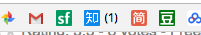

# Project: chrome插件管理bookmark

`#书签 #bookmarks #chrome #automation #youtube`

利用这个特性，可以动态获取facebook、知乎等网站，或某种方式，
获取这些网站的通知，然后在书签上显示出通知数字。
如


## 更新：
设计书签管理的XML或JSON数据结构，方便在一个文件内保持所有标签和相关信息。
包括`title, type(folder/link), description, icon, script...`

此chrome 插件会定期(每分钟)通过服务器的脚本访问或通过本机访问网络指定的地方，更新标签信息：如未读邮件数，网盘剩余容量，日历上的日期，TODO列表的剩余项目等等等等。

书签里的每个文件夹或链接都可以指定单独的脚本，以达到不同的效果。脚本最好支持像POSTMAN一样所有的API功能。

## 更新：
- 设计单独脚本自动读取youtube订阅列表，同步到书签专门文件夹中。
- 设计单独脚本自动读取自己github所有repos（需要权限），同步到专门的文件夹中。

# Project: Chrome 插件，超越google keep的网络内容保存插件 @Oct 30 2017
Chrome 插件，超越google keep的网络内容保存插件
具有逻辑性和线索性
能够记录自己搜索一个问题解答的全部相关文章，按线索性整理排列，并能一键转换为可下载的离线archive（网页PDF或全文截图）

## Project: chrome网页收藏夹插件

不是收藏链接而是存储全部内容，文字型的网页就直接像safari阅读模式一样转化为简单排版文字模式然后再存储。
还可以收藏PDF、图片、gif等。
像google keep一样，插件连接云存储，实现w更完整的内容管理系统。
音频视频就算了
