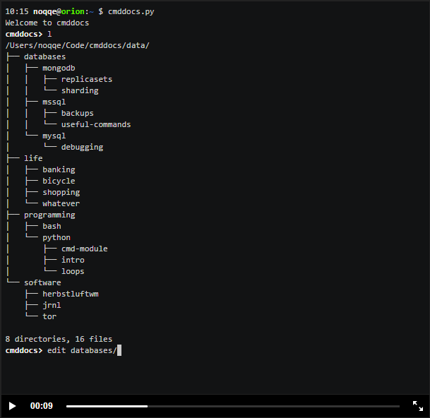

# Project: Design of [S2-TB]
**The Servant Solomon's Tools Box**   
*May God be pleased by this product I'm planning to make. If it works, it will all belongs to your glory.*  

## Introduction of this system
这套系统由Python为基础语言创建，目的为辅助我简化计算机科学相关的一切事务。初期考虑到可以包含且不限于的子项目如下：  
* Reference Letter Database Tools  
* Windows/Linux操作系统相关的管理工作。如系统设置/网络环境等的查询和更改等。  
* 应用软件的查询和设置。如浏览器、办公应用等的查询、添加和配置。  
* 个人日常行为的辅助。包括多设备间的传输、电子邮件的处理、文件的备份同步等。  
* 编程相关的协助。如自动配置各种编程语言、快捷生成博客文章的网页等重复性较高活动  

系统的界面设置，初期想法为：`命令行模式(CLI)`。
这样的优点有很多：一方面可以将涵盖性极广的系统简化为**命令模式**，一方面可以达到一定程度的保密性，还有一方面可以为未来扩展及`人性化操作`（语义分析）提供基础。
	系统的核心竞争力就是其简洁性——真正的简洁。不采用较为复杂的传统*nix系统Shell命令行语法，也不采用现今流行的GUI鼠标点击按钮型页面。一切都以最快速度达到目的为核心来设计系统，就必须突破框架，重新定义。
	为了贯彻“一切为我所用”的原则，对于这个系统的平台搭建，我的设想是：
	> 整套系统都搭建在网络虚拟空间上，以供我随时随地访问，不过个别功能如文件管理等就只能在本地使用了。  
	> 通过CLI作为命令输入，通过HTML5网页作为GUI展现各种多媒体效果，达到一种需求平衡。  

	最后，一定不能忘记的就是荣耀神。  
	Desire是主赐予的，所以我所做的一切都是要荣耀神。
	为了提醒自己这一点，每一个脚本文件中都要有赞美神的话语，各种命名也可以参考圣经中名称。  

## Overview of Applying those funcitons
由于我的编程基础还很差，所以创建此系统是和学习过程同步的。
所以我必须循序渐进，一步一步完善该系统。那么以下是我对实现它的基本思路：
首先是学习阶段的思路：
1. 先学习字符串的操作。语法练习就可以用如何将输入的字符串指令行拆分为具体的命令。  
2.  学习python和各类数据库的交互，包括如何将文件加密存储等。  
3.  学习python与C/PHP/Java等语言的交互。因为这套系统的复杂度是需要多语言合作的，这个过程也涵括了其他语言的学习。    

然后是`系统实现`的思路：  
1. 先不必在乎`Command-Line Interface(CLI)`界面的实现，暂时用python的基本input()交互来代替。  
2. 然后达到能将字符串命令转化为程序能识别的语言。这一步非常重要，将注入系统的核心：即采用“松散语言命令”——人性化的语言来达到命令程序去做一件事，也就是说，要求电脑做同一件事，有可能对应着10种说法，正着说、反着说、说一半，都可以。如果我的语句缺少了必要信息，那么程序会主动向我要求缺少的信息，并给我可参考的选项。当然，我的想法是，先以清晰的“严格命令语言”为基础来实现，然后在其基础上再一步一步添加扩着的“松散语言命令”，这样比较合理。  
3. 基础完成后，首先将整个系统的构造进行明确，进行框架构造。包括如何聚合这些子系统等问题。我的初步想法是，将各个子系统视为一个“包”。需要时候进行引入；然后将包内各个类别的应用各分为一个“模块”，即一个.py文件，其中包含了具体实现功能的函数。  
4)	实现具体功能的第一步是将曾经用Filemaker创造的RLDT系统转为Python版本。即先将数据都转到Mysql或者某数据库中，并创建关系模型；然后对其脚本进行重构，采用面向对象方式；测试完所有功能函数成功后，为每个功能配置多个“松散语言命令”，并进行命令行测试。  
5. 此后就是不断对系统的功能进行扩充，不断对系统的效率进行改进了。  

整个系统分为若干子系统，子系统的命名方式都从影视中著名的机器人或系统而得名。可参考的如下：
`RLDT/R2-D2/C-3PO/WALL-E/Jarvis/Baymax/NS-5/Chobits/Marvin the Paranoid Robot`。
	同样，子模块中也可以运用一些相应的名字，可以参考的是像黑客帝国的名字：`Smith/Matrix/Zion`等。也可以模仿黑客帝国，直接引用圣经中出现的名字，包括`人名、地名或是卷名、章节号`。
	圣经中名称可以是：`Noah/Abraham/Jacob/Rachel/Moses/Samson/Job/Eliphaz/Esther`等

## `RLDT` : Reference Letter Database Tools 
主要用于人员管理。最初的想法是因为看到《恶之教典》中恶魔般教师莲实所使用的分析全校师生用的电脑工具，虽然目的邪恶，但是仔细观察系统界面和逻辑设计，发现其具有非常强大的功用。如果能把它用到正地方，并进行一定扩展，将会是一套价值很高的系统，在删除侵犯隐私和伦理后其可以广泛应用到人力资源、心理学及医学研究上。  
表层功能是记录每个人的相关信息，包括基本信息、学历、工作、人脉、健康、心理、特点、爱好等众多要素，还包括照片、简历、文章、作品等相关文件作为支持性文件。  
深层功能是，自动实现人脉关系整理并绘画出相关关系图；对照片进行像百度云一样的图片理解（如对所有出现的人像进行分析并将人脸用Facebook式框出来待选择人物，再如对每个图片进行单人图、多人图、景色图等识别）；对于心理测试结果进行绘图；对于各项特征给出相关的理论判断和建议，如对于健康信息给出一定的医疗判断。  
前面的基本功能很好做到，目前已通过Filemaker实现。后期的复杂计算和绘图技术，就将通过Python绘图和HTML5绘图来达到了。除了图像识别外，其他的逻辑都不难。对于图像识别，就需要利用现在流行的图像分类算法来处理了，也有可能会需要用到C语言来辅助。  
Filemaker实现基本界面及功能后发现，系统展示是个小问题，算法和数据录入操作才是大问题。由此才引发的我对"松散语言命令"的Command-Line Interface开始探讨。  
如果面对每个人庞大的数据量，都需要用鼠标左点右点，按照树状结构进行录入，工作量是非常大的。所以，如果配合着获取数据的偶然无规律性，我发现如果利用CLI录入会非常方便（如果命令不那么复杂的话）。试想，如果我只需要录入张三的生日，那么我只需要这样写就行了：  

	>>> enter RLDT      #===>进入RLDT系统
	>>> birthday of <张三> is 19991024      #===>输入张三的生日
	>>> birthday, height, undergraduated school, graduated school of <张三> is 19991024,170,北工大，清华
	#上面这句是用来输入多项数据的。

如果遇到以上，其中毕业院校相关的数据不全，那么命令行会提醒用户输入相关的信息（可选）：  

	Please tell me the [enroll date], [graduated date],[GPA] of this school 北工大 of <张三> if you want?  

关于图片解析的重要性。由于人脸识别算法的普及，现在用python实现已经不会那么复杂了。利用这项功能，可以达到人脸验证、How-old分析等，直接套用当前最先进人脸相关科学理论。  

哦对了，还有一大重要功能！——自动生成PDF简历！目前python对生成pdf的经验比对word操作经验还多，所以利用python将已有信息生成pdf简历是非常有意义的。并且，可以添加模板选择功能。

## `Daniel` : Daniel the prophet
这是一个Bible Study子系统。希望以最便捷的方式**记录笔记/查询经文或笔记/对比注解/圣经中数据统计**等。
以下为希望达到的效果：

	# 一、显示经文
	>>> show scripture colossians/1:7-8 niv
	there are (1) related scripture found:
	Colossians 1: [7]You learned it from Epaphras, our dear fellow servant, who is a faithful minister of Christ on our behalf, [8]and who also told us of your love in the Spirit.

	# 二、添加经文笔记
	>>> add note to scripture matthew/23:12 as "凡自高的必降为卑，自卑的必升为高。"
	Scripture Note added:
	Added '凡自高的必降为卑，自卑的必升为高。' to Matthew 23:12 'For those who exalt themselves will be humbled, and those who humble themselves will be exalted.'

	# 三、显示注解
	>>> show biblical explanation of Matthew 16:12
	1. 'Matthew 16:5-12 耶稣教训门徒要防备法利赛人和撒督该人的教训。' from [精读本圣经注释]
	2. ............. from [新旧约辅读]

	# 四、统计数据
	>>> count amount of "don't be afraid" roughly in bible
	roughly matched: 365
	>>> search where person 'Jacob' occured in bible
	Genesis    Exodus    Leviticus    Numbers    Psalm    Isaiah    ............

	# 五、调出某人、某地、某宗派的资料
	>>> show profile of person 'Job' in bible
	Job is the central character of the Book of Job in the Bible. Job is considered a prophet in the Abrahamic religions: Judaism, Christianity, and Islam. In rabbinical literature, Iyov is called one of the prophets of the Gentiles.

	# 六、记录灵修
	>>> new spiritual-diary by use file 'spiritual-diary-day27.md'
	created.
	>>> new spiritual-diary
	(please write it blew:)
	Today is my 1st day to write a spiritual diary here, may God be pleased.

## `WALLEO` : Wall-E Organizer
包括文件管理，Office文件(Word/Excel/PPT)的处理。
其中最重要的就是Word。
然后是各种文件之间的转换，即：
`Word/PDF/PPT/Epub/Mobi/Txt/CHM/Html/Mhtml`等文件的任意之间两两互换。
只需要输入诸如：

	>>> convert mydoc.docx to pdf (use kindle size; new chapter with new page; centered footer)
就能把一个word文件转为pdf，括号里还指定了3项要求：用A4纸; 每一章新起一页; 页脚居中。
当然，还可以在影音多媒体之间任意互换，即：
视频的`avi/wmv/3gp/rmvb/mov/mp4/mpeg/flv`和音频的`mp3/flac/wma/mod`甚至动态图`gif`等等，只要输入如：

	>>> convert myvideo.avi to mpep-4 (re-size 50%)
	>>> convert myvideo.avi to gif (re-size 30%; cut from 12:30:50 to 12:30:00)
第一条是把avi视频转为mpep-4格式，并且尺寸减为50%;
第二条是把视频转为gif动图，尺寸减为30%，截取某一段时间。

## `Web-Jar` : Web Jarvis
网络子系统中，包含爬虫/邮件收发/FTP/云同步/伪装IP/VPN等。  
其中：爬虫的作用有无限种可能，只要是对网络资源的操作都可以归进来，所以为了集合众多爬取并处理的功能到一起，必须要爬虫模块具有高度可扩展性，并且避免代码的大量冗余。  

## `Baymin` : App-Help Companion
辅助对各种软件、应用进行交互。例如，在命令行中输入：  

	search online google,baidu,bing that when will the movie release? 
然后命令行就会打开chrome，分别通过google,百度和必应进行搜索后面的问题。还可以这样：
	
	search online –about tech that how to build cli with python? 
然后命令行就会打开chrome，并在tech技术相关网站进行搜索后面的问题。
还可以和美图秀秀进行交互，例如对指定批量文件进行美图秀秀编辑。  

	
## `C-3PO` : Personal Assistant
目前主要是日记和博客问题，还可以加入各种查询小工具，如天气、车票、快递等。
还有，可以一键将照片或微博发布到多个平台。或者统计一些facebook数据等。

## `R2-D2` : High-level Programming Assistant
一键完成Python/Mysql/Java/Eclipse/Sublime等编程环境；一键完成Wordpress博客设置；
简单构建一套网站；简单构建一套管理系统。

# Pop-out Ideas 
## @1 添加Book子系统  
1. 可以处理我的书籍，自动将kindle笔记添加到书籍相应位置，或者将相关句子摘出来并连带笔记一起添加到markdown的笔记中。  
笔记用普通文字，原文用引用模式。  
2. 自动将txt或word文档的书籍转换为markdown格式，并转换各类标题。  
3. 直接通过指令将笔记添加到书中。  
4. 将我所有的书籍存到数据库中，并对其进行断句、字数、基本信息等的存档，作为缩索引以供日后搜索和处理。  
这是一套非常庞大的数据库，其中可能将所有pdf和mobi书籍都转换成text文本存入数据库，以供系统自动分析并建立索引。  
这其中涉及到重要的`OCR`识别算法，可能要自己动手写这超级复杂的代码了，可以参考git上开源代码。  

## @2 Core usage of this system
It would be the processing of text.
Including:  

>	
- analyze contend of books
- restructure them,
- add book notes,
- smart search (like google search engine) notes or content,
- most important of all,

It can understand abstract meaning by using Probability on words it is possible to achieve.  

