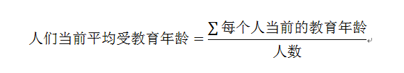
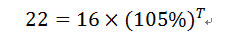
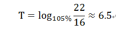
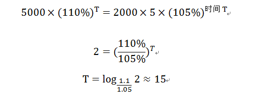

# Statistics: LE时间公式 Created at `2013-12-12`

LE时间（Leonard Elric Time），即计算出人们接受一个概念所需要的时间。  
先设置一个等式，等式的两边，  
一边代表接受这个概念所需要的教育年龄，  
另一边代表达到同等教育程度所需要的时间。  
（这个等式本身就有点想不通是不是正确。。。或者表达不清楚）。
其中，

假设某科学家公开了一个科学研究系统，  
而一般要在博士生级别才能够理解并操作此系统，现在此科学家希望知道某国家10万个相关领域的科研人员，  
用多长时间才能够普及这套系统？  

## 思路：

根据某数据公布，这10万个人的平均受教育年龄在16年，  
即毕业本科生的教育年龄，而预测的平均教育增长率为5%，  
而博士生毕业最少需要22年，那么计算过程如下：  

则  

即需要六年半的时间可以达到。  

另外，如果想算某人多久可以买到一个产品，可以利用如下公式计算：  

张三现在收入每个月5000元，想用某一个月的工资买到5盎司黄金，  
请问他多少年后能够只用一个月的工资就买到5盎司的黄金？  
假设张三的年薪的增长率为10%，黄金当前的价格为2000元/盎司，年增长率为5%。  

## 思路：

如果设计一个公式的话，先假定等式的两边相等，即月收入=5盎司黄金  

如果带入的话就是  

即需要15年后可以买到。  
