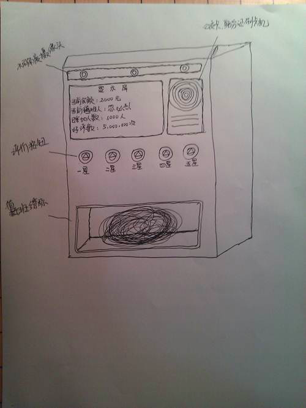

# Business: 车站秩序管制计划 Created at `2013-11-12 0:54`

## 治理公交站插队现象
为了治理乱插队现象，  
在一些公交车站设立捐助箱，希望有人能治理自己每天坐车的车站的人，  
就往里投钱，几块几毛不限，然后就有人自愿领钱来管制，每半小时十块钱。  

这样一来，秩序好的车站没人希望治理，也就没人投钱。  
秩序不好的车站，乘客都希望没人插队，自己又不敢去管，就投几毛钱进去，  
这样只要积攒的钱够了也就代表管制的意愿足了，就可以有人来主动管制。

## 以上是核心原理，实现机制如下:
首先不能过多依赖公交集团的设施和人员，  
这样会涉及到贪污和浪费，即影响供需关系的自动机制的运行。  
必须有第三方来实现。  

如果涉及到人管，那么就会出现不透明，出现利用。  
所以要借助一个新型的机器。  

这部机器可以实现几个功能，
1. 可以投币并统计，并将余额显示在屏幕上，数据链接网络，
每天自动更新，使运作透明化
2. 领受钱的人需要用二代身份证在机器上刷卡，机器对他拍照，留下数据
3. 机器是按半小时计算的，每半小时领一次钱  
4. 领了钱可以从机器盒子中取出绣标，代表自己是管理人员，
绣标上有识别功能，用完了必须交回去否则会留下不良记录  
5. 收费最好是只能刷公交卡，  
这样不涉及到现金存储识别和定期安排人取钱的功能，不像银行卡涉及财产安全

然后再说说这套机制的东西，为了保证管理合格，需要在每个车站设立摄像头，  
或者在机器上添加乘客投票，打分功能，这样机器就可以根据管理者的评分决定是否给予其行驶权。
对于职务的管理范围，包括防止插队，防止混乱，指明路线等等，  
这些是很多老年人可以干的，比如居委会的，有收入还可以维护秩序 。  
2008奥运会的那种街道秩序志愿者的选拔方式就可以参考。
 
 
