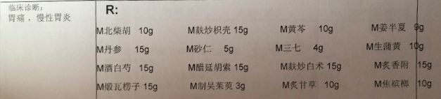

# Project: 在线中药配方

分门别类列出所有中药成分，然后可以自己勾选☑️：
- 包含哪几种成分，
- 每种成分多少g
- 制药方法（熬）

然后，后台算法可以自动给出这种配药的适应症状、可能的不良症状、饮用注意事项（不能吃什么）等信息。

一开始是人为编辑，之后可以机器学习算法来加强。
每个人上传医院给自己开出的配方以及相应的症状。

其实可以做成像`作业帮app`一样的效果，直接给处方拍照，自动识别并解析，一步完成。
