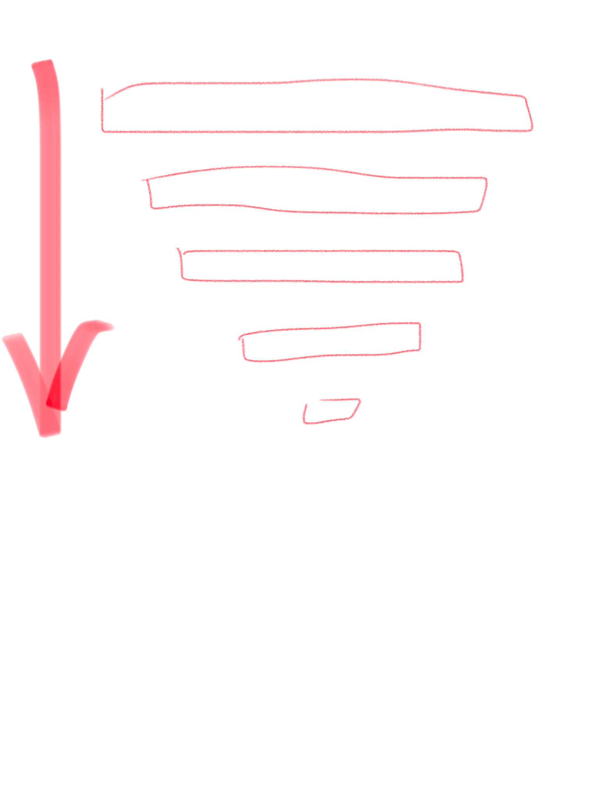
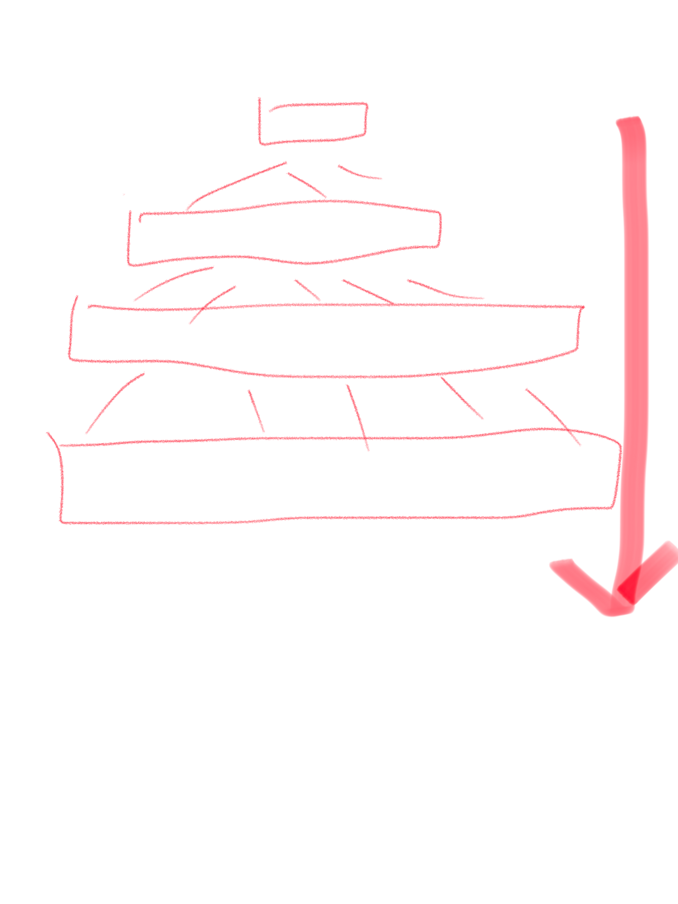

# Idea: 分层渐进式脑图 Mind Map Layers
`@20-Jan-2019`

普通的脑图缺点是一股脑全部展现出来所有概念，只有结构，没有顺序。而人接受和完善知识体系是有顺序的：由浅入深。
也就是先了解所有内容的浅层，再逐步针对某个或各个内容进行深入，达到一定水平或完成这一层面知识理解后，再深入下一层理解。
这才是正确和健康的学习顺序。

或

 应该从上往下一层一层来。

