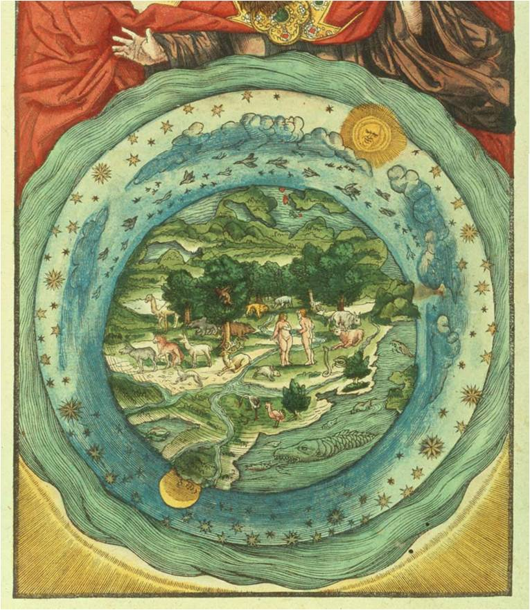

# `The creation` Genesis 1~2

## Gen 1
Genesis one is all about how the universe and all creatures were created. 

### Gen 1:21
> Sea creatures first , then the rest earth creatures .
Response to the made up idea of `Evolution`

### Gen 1:22
> It was amazingly deep in the word `blessing`.
**First blessing of the universe**

> `Multiply` to the living creatures is not only a blessing, but root in living creatures’ nature. 
`Sex` was a blessing at the first place. 
Only when the creature abuses it, it becomes a sin. 

> Besides, 
Q: what’s the meaning of letting bird multiply on earth ?

### Gen 1:24
> In KJV, it’s `in his kind`
Q: Not sure what it means 

> Q: What exactly is the “creeping things” ?

### Gen 1:27
> Repeated twice : image of God

### Gen 1:30
> For every creatures He has given `green plants` as food. 
Before any killing, we are all VEGETARIANS.

## Gen 2
Genesis two is mainly to detail the creations from chapter one.

### Gen 2:3
> God made the seventh day HOLY.
Q: How is it holy? It must be different from other days. Should we consider one day is holy than another?

### Gen 2:5
> Time theory
No plants had yet sprung up because no rain. 
There’s the idea against `Evolution`: 
It seems **time was frozen** for the plants, can’t die or grow. 
Time was not moving until the rain drop down.
We could apply the same way about time to: stars, lights, living creatures. 

### Gen 2:7
> `The breath of life`.
Q: What’s so special about that breath, why does it have to be breath than other way?

### Gen 2:8
> God created man first, **AFTER** it created the garden.

> Garden is in the `east`. So it’s not always bad in the bible about the east.
(In the bible, when God punish someone, He often let him go east.)

### Gen 2:9
> God made trees in garden that either **pleasant to sight** or **good for food**, 
Q: so which one that `tree of life` and `tree of knowledge` belong to ?
TOL good for sight, or TOK good for food?

- Gen 3:6 answered: TOK is both good for food and sight, and brings cleverness .

> `Tree of knowledge of good and evil`
Q: Does it mean it only has the knowledge about good and evil, not all knowledge?

### Gen 2:15
> God let man to be steward in the garden to take care of it, like an assistant. 
Doesn't it depict the `original relationship` designed between God and man . 

### Gen 2:17
> God knows what will happen that man will sin but still warn him. 
What was God thinking then?
I could say , **knowing what will happen is not the reason for what He should do**.
And God must not be trapped by the `time theory` or `butterfly effect`, 
nor force Himself to make the future happen. 
It could be the best way to do so among all other way, 
or even it could be His favourite way among all other ways.
To think about this question, must have a strong intuition about time theory or related idea. 
Couldn’t just say that: why should God put tree of knowledge here at first place.

### Gen 2:18
> God wants Adam to have a helper, 
notice that: here God did not just made Eva all of sudden, 
but led all living creatures to Adam and let him choose.
But he didn’t choose anyone as a helper, 
after all that, God made the idea to make a woman for him.

### Gen 2:21
> God causes a `deep sleep` upon man and took out his rib:
`World’s first surgery`, with strong `anaesthetic`. 
Not "sleep" but "deep sleep", so he could t feel pain.

### Gen 2:22
> Sounds like `gene clone project`: 
take a part of human and make a copy , with altered DNA.
Can’t say God is not `the first and the best doctor and biologist`.

