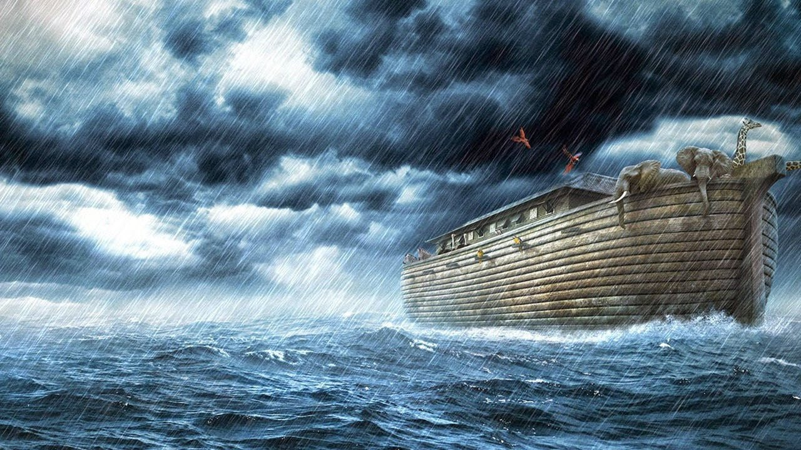

# `Coming of the Great Flood` Genesis 7

### Genesis 7:2
> (✔︎) Q: Noah had already had all kinds of animal, what does it mean to take 7 pairs ?
A: It actually can be translated as "7 pairs of each kind", that makes more sense.

### Genesis 7:11
> In regard to this date so detailed , we could easily conduct what exact day did the great Flood came.

> Graph: How did it look like that the window was opened?

### Genesis 7:14
> Research: Since then they’ve got the knowledge of categorise all creatures, what’s the term for that ? Biology?

### Genesis 7:17
> "Rose high above the earth", means the flood was higher than the highest point of any mountain on earth.
Imagine that, no creature would survive in this condition (except some sea creatures). Even bird had no place to land.

### Genesis 7:20
> "`fifteen cubits` deep."
Exact number ! It’s good for researching

### Genesis 7:19
> Probably the waters in the ancient time were not THAT deep like now. But because this Flood, many mountains were still hidden in waters, that human haven’t fully discovered yet

### Genesis 7:21
> Clearly said “sweaming creatures” died, so it even included fish, shark, whales

### Genesis 7:23
> Birds died because nowhere to stand to rest and to eat

### Genesis 7:24
> Stats: How to calculate or stimulate the situation for earth with these number

