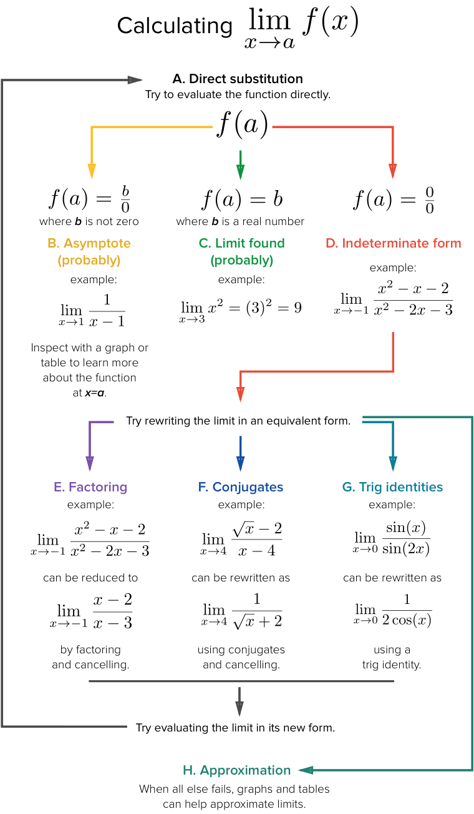

# Limits

> Limits are all about approaching.
And the entire Calculus is built upon this concept.

## Strategy in finding Limits

[Refer to Khan academy.](https://www.khanacademy.org/math/ap-calculus-ab/ab-limits-continuity/ab-limit-strategy/a/limit-strategies-flow-chart)

