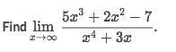
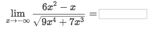
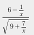
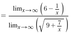
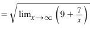
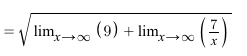
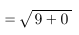
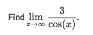
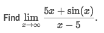

# Limits at 「infinity」

No matter why kinds of Limits you're looking for, 
to understand it better, 
the best way is to read the `Step-by-Step Solution` from `Symbolab`:
[Limit Calculator from Symbolab.](https://www.symbolab.com/solver/limit-calculator/%5Clim_%7Bx%5Cto%5Cinfty%7D%5Cleft(%5Cfrac%7B6x%5E%7B2%7D-x%7D%7B%5Csqrt%7B9x%5E%7B4%7D%2B7x%5E%7B3%7D%7D%7D%5Cright))

## 「Rational functions」

> The KEY point is to look at the powers & coefficients of Numerator & Dominator.
Just the same with `Finding the Asymptote`.

[Refer to previous note on the `How to find Asymptote`](https://github.com/solomonxie/solomonxie.github.io/issues/44#issuecomment-374894945).

### Example

Solve:

## Quotients with 「square roots」

> The KEY point is to calculate both `numerator & dominator`, then calculate the limit of EACH term with in the square root.

### Example

Solve:
[Refer to Symbolab step-by-step solution.](https://www.symbolab.com/solver/limit-calculator/%5Clim_%7Bx%5Cto%5Cinfty%7D%5Cleft(%5Cfrac%7B6x%5E%7B2%7D-x%7D%7B%5Csqrt%7B9x%5E%7B4%7D%2B7x%5E%7B3%7D%7D%7D%5Cright))
- Divide by **highest** dominator power to get:

- Calculate separately the limit of `Numerator` & `Dominator`:

- Calculate the `Square root`: Need to find limits for **EACH** term **inside** the square root.

- Then get the result easily.

## Quotients with 「trig」

> The KEY point is to apply the **`Squeeze theorem`**, and it is a MUST.

### Example

Solve:
- Know that `-1 ≦ cos(x) ≦ 1`, so we can tweak it to apply the `squeeze theorem` to get its limit.
- Make the inequality to: `3/-1 ≦ 3/cos(x)/-1 ≦ 3/1`
- Get that right side `3/-1 = -1` and left side `3/1 =1` is not equal.
- So the limit doesn't exist.

**Easier solution steps**:
- Know the inequality `-1 ≦ cos(x) ≦ 1`
- Replace `cos(x)` to ` ±1` in the equation, `3/±1`.
- Calculate limits of two sides.
- If the results are exactly the same, then the limit is the result; Otherwise the limit doesn't exist.

### Example

Solve:
- Know that `-1 ≦ sin(x) ≦ 1`
- Replace `sin(x)` as `±1`
- Left side becomes `(5x+1)/(x-5)`, right side becomes `(5x-1)/(x-5)`
- Both sides' limits are `5`, so the limit exists, and is `5`.
