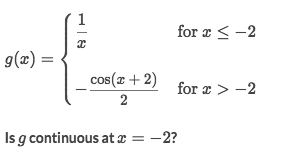

# Analyzing functions for discontinuities「algebraic」

> If the limits of both side of some point, are EQUAL, then it's continuous at this point.

At a point `a`, for `f(x)` to be continuous at `x=a`, we need `lim(x→a)f(x) = f(a)`.

### Example

Solve:
- Got the limit of left side is `-1/2`
- Got the limit of right side is `-1/2`
- They're equal, so it's continuous at this point.
