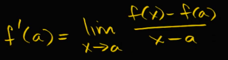
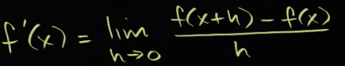
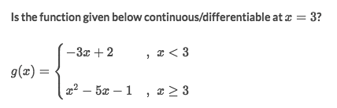
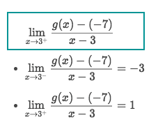
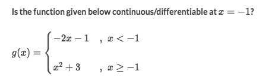

#  ❖ Derivative equation

The idea of derivative equation is quite simple: **The LIMIT of the SLOPE.**

> The slope is equal to `change in Y / change in X`. 
So for a point `a`, we IMAGINE we have another near point which lies on the SAME LINE with `a`, 
and since we have TWO POINTS now, 
we can then let their `Y-value Change` divided by their `X-value Change` to get the slope.

There're two equations for calculating derivative at a point, and the only different thing is how to express the IMAGINARY POINT with respect to the point `a`, it could either be `x` or `a+h` :

or:

## How to calculate 「derivative」

Strategy:
- Determine if it's **CONTINUOUS** at this point, by:
    - See if the point is defined in the interval
    - Calculate **LIMITS** of both RIGHT SIDE and LEFT SIDE of the point.
    - If two sides' limits are the same, then it's continuous. Otherwise it's discontinuous.
- Determine if it's **DIFFERENTIABLE** (Actually is the process of getting its **derivative**):
    - Apply Derivative equation to get both RIGHT SIDE LIMIT and LEFT SIDE LIMIT.
    - If two sides' limits are the same, then that value is the **Derivative** at the point. If not, then it's NOT DIFFERENTIABLE.

### Example

Solve:
- See that the point `3` is defined in the interval.
- Left side limit of the point, is using the first equation, and gets the `lim g(x) = -7`
- Right side limit of the point, is using the second equation, and gets the `lim g(x) = -7`
- Limits of both sides are the SAME, so it's continuous, and let's see if it's differentiable.
- Apply the derivative equation for both Left side  & Right side:

- Both sides' limits exists but not that same, so it's not differentiable.

### Example

Solve:
- See that the point `-1` is defined in the interval.
- Left side limit of the point, is using the first equation, and gets the `lim g(x) = 1`
- Right side limit of the point, is using the second equation, and gets the `lim g(x) = 4`
- Limits of both sides are NOT SAME, so it's not continuous, then of course not differentiable.
