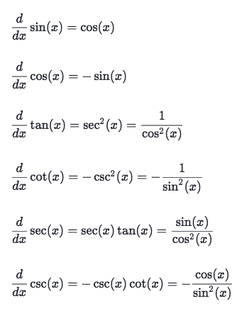
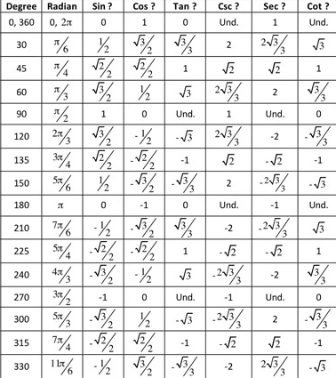

# Derivatives of 「Trig functions」



## Reminder of 「Trig identities」 & 「Unit circle」 values
```py
# Reciprocal and quotient identities
tan(θ) = sin(θ) / cos(θ)
csc(θ) = 1/sin(θ)
sec(θ) = 1/cos(θ)
cot(θ) = 1/tan(θ)
```

[Refer to previous note of all trig identities.](https://github.com/solomonxie/solomonxie.github.io/issues/44#issuecomment-377684464)




