#  ❖ Implicit Differentiation

> Bit hard to understand it in the first place.

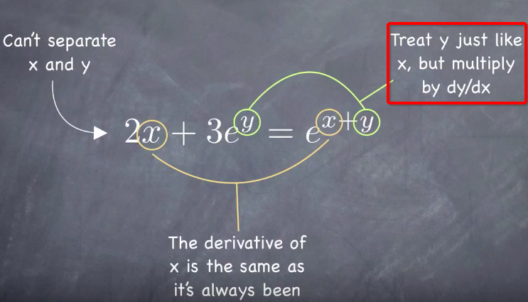

## What is 「Implicit」 & 「Explicit Function」

[Refer to video by Krista King: What is implicit differentiation?](https://www.youtube.com/watch?v=GpWCFoCznGI)

- `Explicit function`: it's the normal function we've seen a lot before, which's in the form of `y = x....`
- `Implicit function`: it't NOT YET in the general form of a function and not easily separated, like `x² + y² = 1`

So knowing how to differentiate an `implicit function` is quite helpful when we're dealing with those NOT EASILY SEPARATED functions.

## How to Differentiate 「Implicit function」

[Refer to video: Use implicit differentiation to find the second derivative of y (y'') (KristaKingMath)](https://www.youtube.com/watch?v=MzwcOw27ZRE)
[Refer to video by The Organic Chemistry Tutor: Implicit Differentiation Explained - Product Rule, Quotient & Chain Rule - Calculus](https://www.youtube.com/watch?v=LGY-DjFsALc)

[Refer to Symbolab: Implicit Derivative Calculator](https://www.symbolab.com/solver/implicit-derivative-calculator/implicit%20derivative%20%5Cfrac%7Bdy%7D%7Bdx%7D%2C%20x%5E%7B2%7D%2Bxy%2By%5E%7B3%7D%3D0)

Assume you are to differentiate `Y` **WITH RESPECT** to `X`, written as `dy/dx`:
- Differentiate terms with `X` as normal
- Differentiate terms with `Y` as the same to `X`, BUT multiply by `(dy/dx)`
- Differentiate terms **MIXED** with `X & Y` by using `Product Rule`, then differentiate each term.

### How to differentiate 「Y with respect to X」

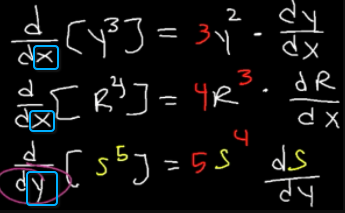

### How to differentiate 「term MIXED with both X & Y」

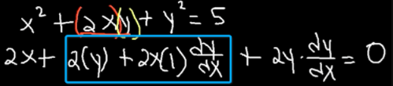

### Example
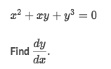
Solve:
[Refer to Symbolab: Implicit Derivative Calculator](https://www.symbolab.com/solver/implicit-derivative-calculator/implicit%20derivative%20%5Cfrac%7Bdy%7D%7Bdx%7D%2C%20x%5E%7B2%7D%2Bxy%2By%5E%7B3%7D%3D0)

- Treat `y` as `y(x)`
- Apply the Sum Rule:
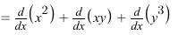
- Apply the normal rules to `X term`, and
- Apply the Product Rule to the `Mixed term`, and
- Apply the Chain Rule to the `Y term`:
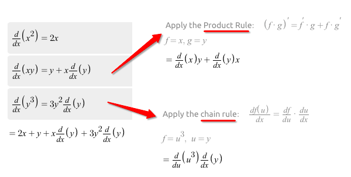
- Operate the equation and **solve for `dy/dx`**, and get:
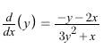

### Example
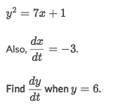
Solve:
- First thing we need to find the **RIGHT** equation of Chain rule. Since it's asking us to find `dy/dt`, so we will re-write it to this one to form an equation:
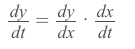
- Then since we've given the `dx/dt = -3`, we only need to find out the `dy/dx` to get the result.
- We've got an equation of `x & y`, regardless whom it's respecting to. So we can do either `Implicit or Explicit differentiation` to the equation `y²=7x+1`, with respect to `y`:
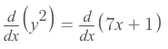
- Use the implicit differentiation method, we got the `dy/dx = 7/2y`
- And since `y=6`, so `7/2y = 7/12`
- Back to the Chain Rule equation, we get `dy/dt = 7/12 · (-3) = -7/4 = -1.75`

### Example
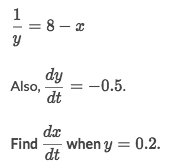
Solve:
- Remind you that, in this problem, it's **NOT** respecting to `x` anymore, so you need to change mind before getting confused.
- First thing we need to find the **RIGHT** equation of Chain rule. Since it's asking us to find `dx/dt`, so we will re-write it to this one to form an equation:
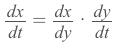
- Then since we've given the `dy/dt = -0.5`, we only need to find out the `dx/dy` to get the result.
- We've got an equation of `x & y`, regardless whom it's respecting to. It seems easier to **differentiate** explicitly:
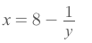
- Then we use `d/dx` to differentiate the equation to get: `dx/dy = y⁻² = (0.2)⁻² = 25`
- Back to the Chain Rule equation, we get `dx/dt = dx/dy · dy/dt = 25 * (-0.5) = -12.5`.

### Example
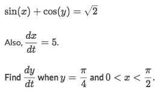
Solve (Same with above examples):
- Form an equation: 
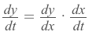
- `dx/dt` has been given equals to `5`, so just to find out `dy/dx`:
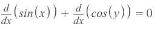
- And get:
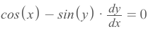
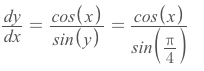
- Now let's see what is `sin(x)` equal to:
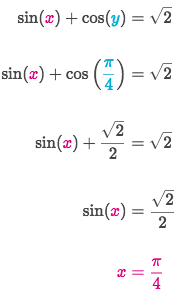
- All done.

## 「Vertical & Horizontal Tangents」 of 「Implicit Equations」

[`► Jump over to Khan academy for practice.`](https://www.khanacademy.org/math/ap-calculus-bc?t=practice)

### Example
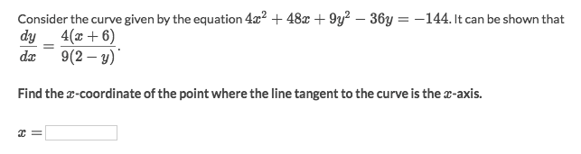
Solve:
- Plug in `y = 0` into the equation and get that `x = -6`, which is the answer.

### Example
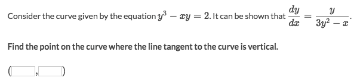
Solve:
- To have a `Vertical Tangent`, we have to let the **derivative** become `Undefined`,
- which in this case is to let the denominator equal to zero:
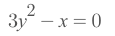
- Solve this equation out we get that `x = 3y²`, which means this relationship is true at the point of vertical tangent line.
- Plug that back to the original function to get `y = -1`, which means the vertical tangent goes through this point.
- Substitute y back and get `x = 3`
- The answer is `(3, -1)`.
