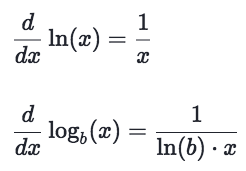
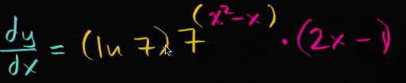

# Derivative of 「exponential functions」

> It's save a lot of time of life not to dig in how mathematicians developed these formulas.
If you do want to, [refer to Khan's lecture: Exponential functions differentiation intro](https://www.khanacademy.org/math/ap-calculus-ab/ab-derivatives-advanced/modal/v/exponential-functions-differentiation-intro)

Reminder: **Don't forget it's a `composite function` and you need to apply the chain rule.**

## Derivative of 「log functions」

## Examples
Find the derivative of:

Solve:

