#  ❖ Extrema: 「Maxima」 & 「Minima」

`Extrema` are one type of Critical points, which includes `Maxima` & `Minima`.
And there're two types of Max and Min, `Global Max & Local Max`, `Global Min & Local Min`.
We can all them `Global Extrema` or `Local Extrema`.

And actually we can call them in different ways, e.g.:
- `Global Max` & `Local Max` or in short of `glo max` & `loc max`
- `Absolute Max` & `Relative Max` or in short of`abs max` & `rel max`

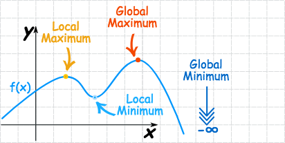

### How to identify 「Extrema」

We need two kind of conditions to identify the Max or Min. 
Now If we have a Non-Endpoint Minimum or Maximum point at `a`, then it must satisfies these conditions:
- **Geometric condition:** (It should be understood in a more intuitive way)
    - in the interval `[a-h, a+h]` there's no point above or below `f(a)` or
    - `f'(a-h)` & `f'(a+h)` have different sign, one negative another positive.
- **Derivative condition:**
    - `f'(a) = 0` or 
    - `f'(a) is undefined`

### How to find 「Extrema」

[Refer to Khan academy lecture: Finding critical points](https://www.khanacademy.org/math/ap-calculus-ab/ab-derivatives-analyze-functions/modal/v/finding-critical-numbers)

We just need to assume `f'(x) = 0` or `f'(x) is undefined`, and solve the equation to see what `x` value makes it then.

## 「Increasing」 & 「Decreasing Intervals」

We can easily tell at a point of a function, it's at the trending of increasing or decreasing, by just looking at the `instantaneous slope` of the point, aka. the derivate. 
If the derivative, the slope is positive, then it's increasing. Otherwise it's decreasing.

### Finding the 「trending」 at a point

Just been said above, we assume at point `a`, it's value is `f(a)`. So the slope of it is `f'(a)`.
And if `f'(a) < 0`, then it's decreasing; If `f'(a) > 0`, then it's increasing.

### Finding a 「decreasing or increasing interval」

[Refer to Khan lecture.](https://www.khanacademy.org/math/ap-calculus-ab/ab-derivatives-analyze-functions/modal/v/increasing-decreasing-intervals-given-the-function)

It's just doing the same thing in the opposite way.
For find a decreasing interval, we assume `f'(x) < 0`, and by solving the inequality equation we will get the interval.

Strategy:
- Get Critical points.
- Separate intervals according to `critical points`, `undefined points` and `endpoints`.
- Try easy numbers in EACH intervals, to decide its TRENDING (going up/down):
    - If `f'(x) > 0` then the trending of this interval is **Increasing**.
    - If `f'(x) < 0` then the trending of this interval is **Decreasing**.

### Example
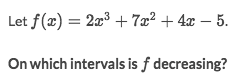
Solve:
- Set `f'(x) = 0 or undefined`, get `x = -2 or -1/3`
- Separate intervals to `(-∞, -2, -1/3, ∞)`
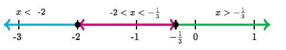
- Try some easy numbers in each interval: `-3, -1, 0`:
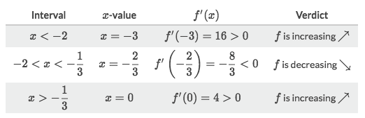

## How to find 「Relative Extrema」

> Remember that an `Absolute extreme` is also a `Relative extreme`.

[Refer to khan: Worked example: finding relative extrema](https://www.khanacademy.org/math/ap-calculus-ab/ab-derivatives-analyze-functions/modal/v/finding-relative-maximum-example)
[Refer to Khan Academy article: Finding relative extrema](https://www.khanacademy.org/math/ap-calculus-ab/ab-derivatives-analyze-functions/modal/a/applying-the-first-derivative-test-to-find-extrema)

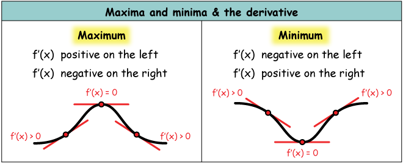

Strategy:
- Get Critical points.
- Separate intervals according to `critical points`, `undefined points` and `endpoints`.
- Try easy numbers in EACH intervals, to decide its TRENDING (going up/down).
- Decide each critical point is Max, Min or Not Extreme.

[Refer to an awesome article: Using calculus to learn more about the shapes of functions](http://xaktly.com/CurveSketching.html)

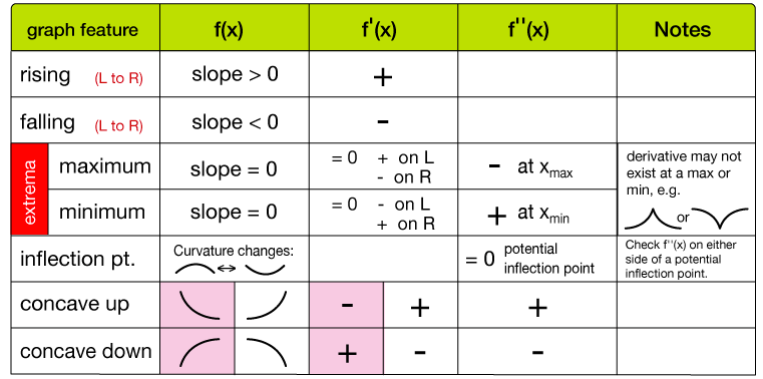

### Example
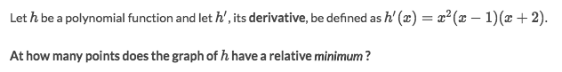
Solve:
- Set `f'(x)=0 or undefined`, get `x=0 or -2 or 1`
- Separate intervals to `(-∞, -2, 0, 1, ∞)`
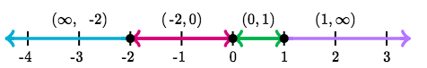
- Try easy number in each interval: `-3, -1, 0.5, 2` and get the trendings:
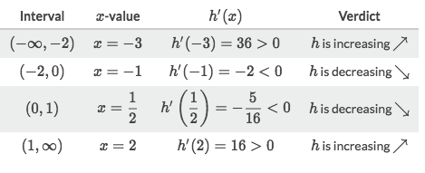
- Identify critical points' **concavity**:
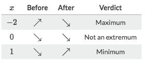

## How to find 「Absolute Extrema」

[Refer to Khan academy article: Absolute minima & maxima review](https://www.khanacademy.org/math/ap-calculus-ab/ab-derivatives-analyze-functions/modal/a/absolute-minima-and-maxima-review)
[Refer to Khan academy lecture: Finding absolute extrema on a closed interval](https://www.khanacademy.org/math/ap-calculus-ab/ab-derivatives-analyze-functions/modal/v/using-extreme-value-theorem)

Strategy:
- Find all `Relative extrema`
    - Get Critical points.
    - Separate intervals according to critical points & endpoints.
    - Try easy numbers in EACH intervals, to decide its TRENDING (going up/down).
    - Decide each critical point is Max, Min or Not Extreme.
- Input all the extreme point into original function `f(x)` and get extreme value.

### Example
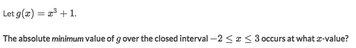
Solve:
- Set `g'(x) = 0 or undefined` get `x=0`
- Separate intervals to `[-2, 0, 3]` according to the critical point & endpoints of the given condition.
- Try some easy numbers of each interval `-1, 2` into `g'(x)`
- Get the trending of each interval: `(+, +)`
- So the minimum must be the left endpoint of the given condition, which is `x=-2`.

### Example
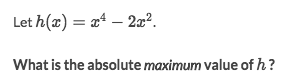
Solve:
- Differentiate to set `f'(x)=0` and got `x=0, -1, 1`
- Separate intervals to `(-∞, -1, 0, 1, +∞)`
- Try some easy numbers in each interval for `f'(x)` and got the signs: `-, +, -, +`
- According to the signs we know that `-, +` gives us a `Relative maximum`
- But at the end it's `+` again, and the interval is going up to `+∞`, means `f(x)` will go infinitely high.
- So there's NO Absolute maximum.
