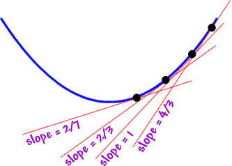
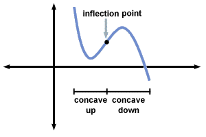
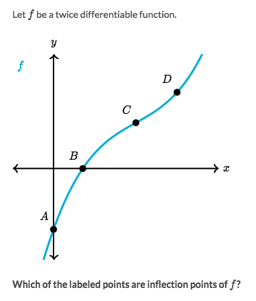
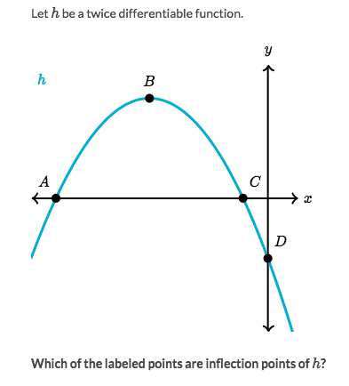
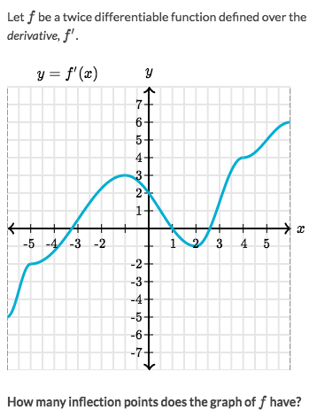
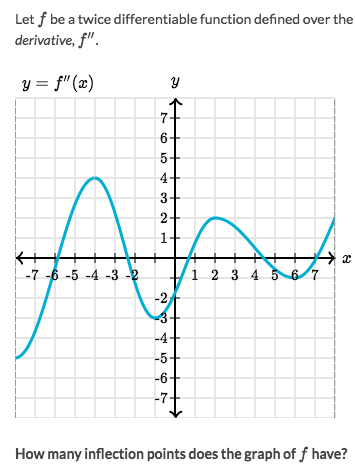
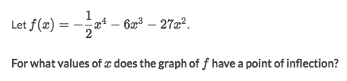
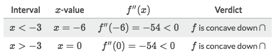
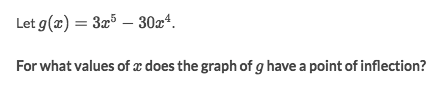
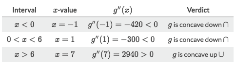

#  ❖ Inflection Point

> An inflection point is a point where the graph of the function **changes** CONCAVITY (from up to down or vice versa).

It could be seen as a `Switching point`, which means the point that the `Slope` of function switch from increasing and decreasing. 
e.g., the function might be **still going up**, but at such a point **it suddenly increases slower and slower**. And we call that point an `inflection point`.

[Refer to Khan academy video for more intuition rapidly: Inflection points from graphs of function & derivatives](https://www.khanacademy.org/math/ap-calculus-ab/ab-derivatives-analyze-functions/modal/v/identifying-inflection-points-from-graphs-of-function-and-derivatives)

Algebraically, we identify and express this point by the function's `First Derivative` OR `Second Derivative`.

### Example

Intuitive way to solve:
- Draw a **tangent line** in imagination and move it on the function from left to right
- Notice the tangent line's slope, does it go faster or slower or suddenly change its pace at a point?
- We found it suddenly changed at point `c`.

More definitional way to solve:
- Looking for the `parts of concavity shapes`
- Seems that `B-C` is a part of `Concave Down`, and `C-D` is a part of `Concave Up`
- So `C` is a SWITCHING POINT, it's a `inflection point`.

### Example

Solve:
- Looking for the `parts of concavity shapes`
- There's no changing of concavity shapes, there's only one shape: Concave down.

### Example

Solve:
- Notice that's the graph of **`f'(x)`**, which is the First Derivative.
- Checking `Inflection point` from 1st Derivative is easy: just to look at the change of direction.
- Obviously there're only two points changed direction: -1 & 2

### Example

Solve:
- Mind that this is the graph of **`f''(x)`**, which is the Second derivative.
- Checking `inflection points` from 2nd derivative is even easier: just to look at when it changes its sign, or say crosses the X-axis.
- Obviously, it crosses the X-axis 5 times. So there're 5 inflection points of `f(x)`.

### Example: Finding Inflection points

Solve:
- Function has **POSSIBLE** inflection points when `f''(x) = 0`.
- Set `f''(x) =0 ` and solve for `x`, got `x=-3`. 
- We now know the possible point, but don't know its **CONCAVITY**. This need to try some numbers from its both sides:

- So it didn't change the concavity at point `-3`, means there's no inflection point for function.

### Example: Finding Inflection points

Solve:
- Function has **POSSIBLE** inflection points when `f''(x) = 0`.
- Set `f''(x) =0 ` and solve for `x`, got `x=0 or 6`. 
[Refer to Symbolab for `f''(x)`.](https://www.symbolab.com/solver/step-by-step/%5Cfrac%7Bd%5E%7B2%7D%7D%7Bdx%5E%7B2%7D%7D%5Cleft(3x%5E%7B5%7D-30x%5E%7B4%7D%5Cright))
[Refer to Symbolab for `f''(x)=0`.](https://www.symbolab.com/solver/step-by-step/60x%5E%7B3%7D-360x%5E%7B2%7D%3D0)
- We now know the possible point, but don't know its **CONCAVITY**. This need to try some numbers from its both sides:

- So it didn't change the concavity at point `0`, means only `6` is the inflection point.
