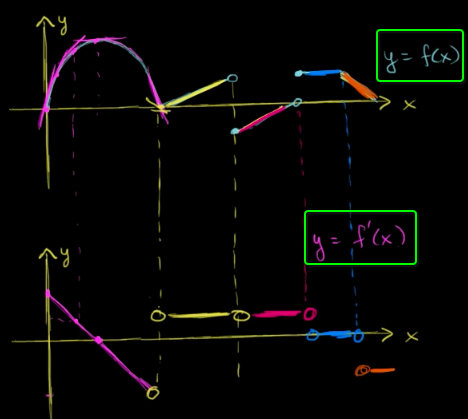
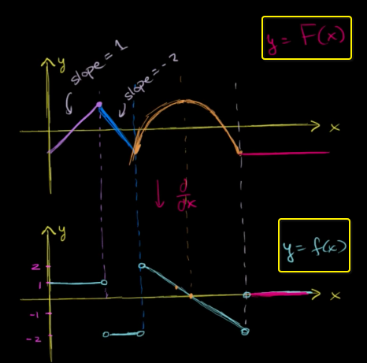
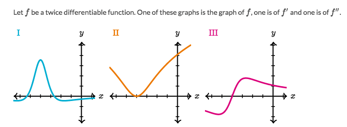

#  ❖ Anti-derivative

Looks like a fancy word, but it just means: Use the **Derivative function** describe the **Original function**.

Notice that: There might be multiple possible anti-derivatives.

## The 「graphical relationship」 between a function & its derivative

[Refer to Khan academy: The graphical relationship between a function & its derivative (Part 1)](https://www.khanacademy.org/math/ap-calculus-ab/ab-derivatives-analyze-functions/modal/v/intuitively-drawing-the-derivative-of-a-function)

## How to draw the function's 「Anti-derivative」

[Refer to Khan academy: The graphical relationship between a function & its derivative (part 2)](https://www.khanacademy.org/math/ap-calculus-ab/ab-derivatives-analyze-functions/modal/v/intuitively-drawing-the-anitderivative-of-a-function)

### Example
[Refer to Khan academy.](https://www.khanacademy.org/math/ap-calculus-ab/ab-derivatives-analyze-functions/modal/e/connecting-function-and-derivatives)

