#  ❖ 「Integral Calculus」 basics

Integral calculus is a process to calculate the **`AREA`** between a function and the X-axis (or Y-axis).

## Core idea of 「Integral Calculus」

[Refer to Khan academy: Introduction to integral calculus](https://www.khanacademy.org/math/ap-calculus-bc/bc-accumulation-riemann-sums/modal/v/introduction-to-integral-calculus)

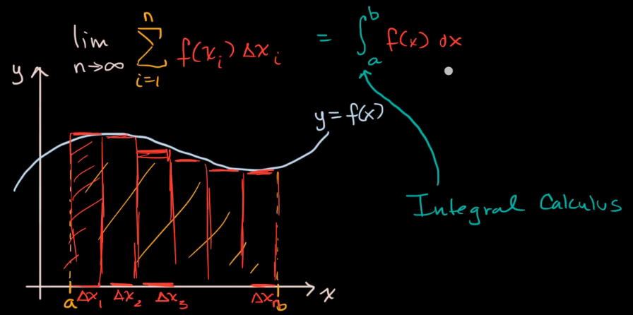

## 「Riemann Sums」

A Riemann sum is an **approximation** of the area under a curve by dividing it into multiple simple shapes (like rectangles or trapezoids).

### 「Riemann Sums」 Notation

[Refer to Khan academy: Definite integral as the limit of a Riemann sum](https://www.khanacademy.org/math/ap-calculus-bc/bc-accumulation-riemann-sums/modal/v/riemann-sums-and-integrals)

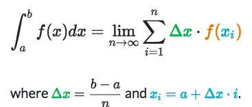

The letter `ʃ` (reads as "esh" or just "integral") is called `the Integral symbol/sign`.

### Calculate 「Riemann Sums」

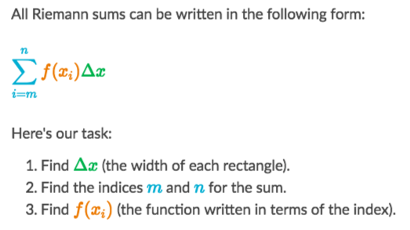

Finding `𝚫x`:
It's meant to get **HOW MANY** rectangles we're to sum.
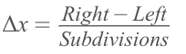

Finding indices `m & n`:
It's meant to find the `i` for `Σ` sums:
- For `Left Sums` or `Midpoint Sums`: `i` starts from `0` ends with `subdivisions - 1`
- For `Right Sums`: `i` starts from `1` ends with `subdivisions`

Finding `xi`:
With equally spaced points (left/right/mid), the `xi` is a **`Geometric series`** of those points, which the **rate** is the `𝚫x`.
We're gonna find the right pattern/equation for `xi`, so that we can plug `xi` into `f(x)`.

Finding `f(xi)`:
Just to plug in the Geometric series expression of `xi` into `f(x)`, 
and make it as **a function in terms of i**.

### 「Left Riemann Sums」 & 「Right Riemann Sums」 Approximation

[Refer to Maths is fun: Integral Approximations](https://www.mathsisfun.com/calculus/integral-approximations.html)

- `Left Riemann Sum`: take the **Left boundary value** of Δx to be the rectangle's **height**.
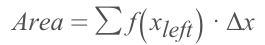
- `Right Riemann Sum`: take the **Right boundary value** of Δx to be the rectangle's **height**.
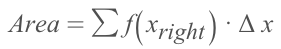

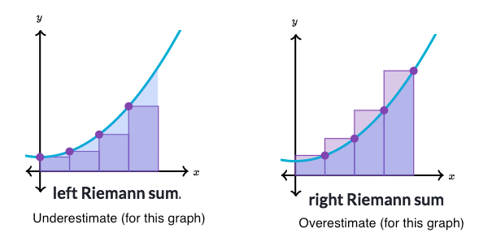

As you can see, they would be either Over-estimated or Under-estimated. Neither of these approximations would be called a good one, normally.

### 「Midpoint Sums」 Approximation

It's an enhancement to the Left sums and Right sums, it takes the midpoint value, and sometimes makes better approximation.

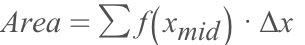

### Example
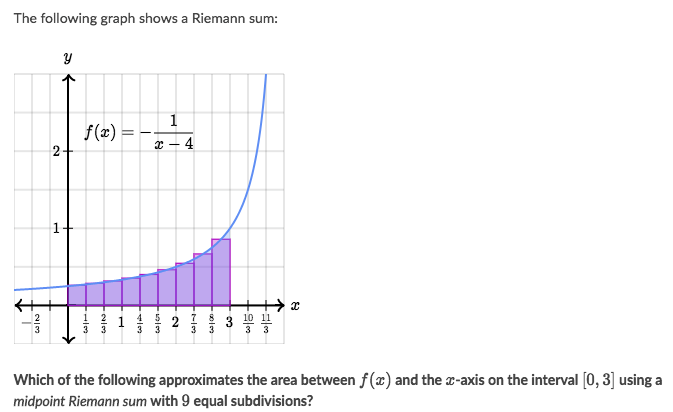
Solve:

### Example
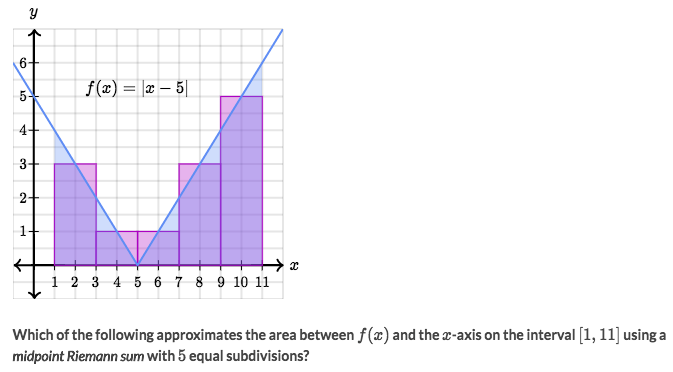
Solve:
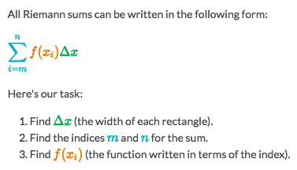

- It's easy to find the `Δx=2`.
- Then let's find the `f(x𝖎)`. It's actually a progress to find the `Arithmetic Sequence`.
- So the sequnce is `S(𝖎) = a + 𝖎·Δx = 2 + 2𝖎`, where `a` represents the first `x` value which is `2`.
- So `x𝖎 = S(𝖎) = 2+2𝖎`
- Takes it back to the function and gets: `f(x𝖎) = |2+2i-5| = |2i -3|`

### Example
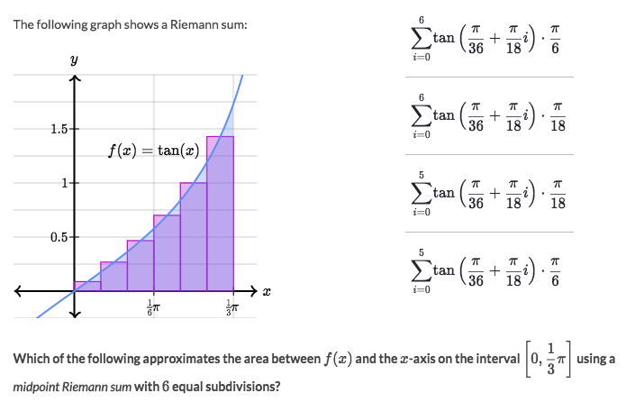
Solve:

### Example
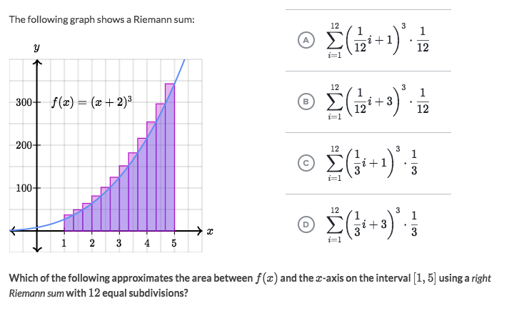
Solve:
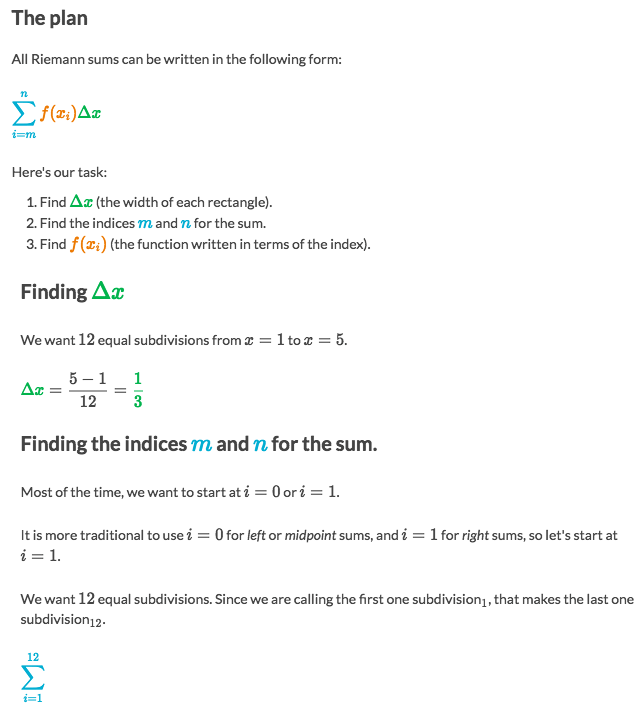
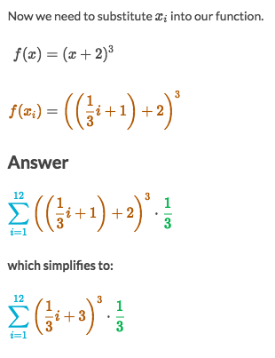

## How to calculate 「Riemann Sums」

[Refer to Khan academy:  Rewriting definite integral as limit of Riemann sum](https://www.khanacademy.org/math/ap-calculus-bc/bc-accumulation-riemann-sums/modal/v/rewriting-definite-integral-as-limit-of-riemann-sum)

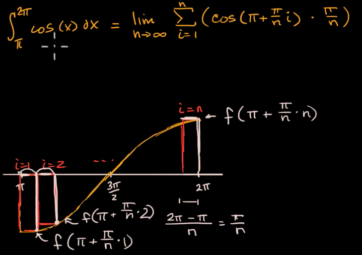

[Refer to the Map of Integration: mrozarka.com](http://stem.mrozarka.com/calculus-1/units/unit-4)
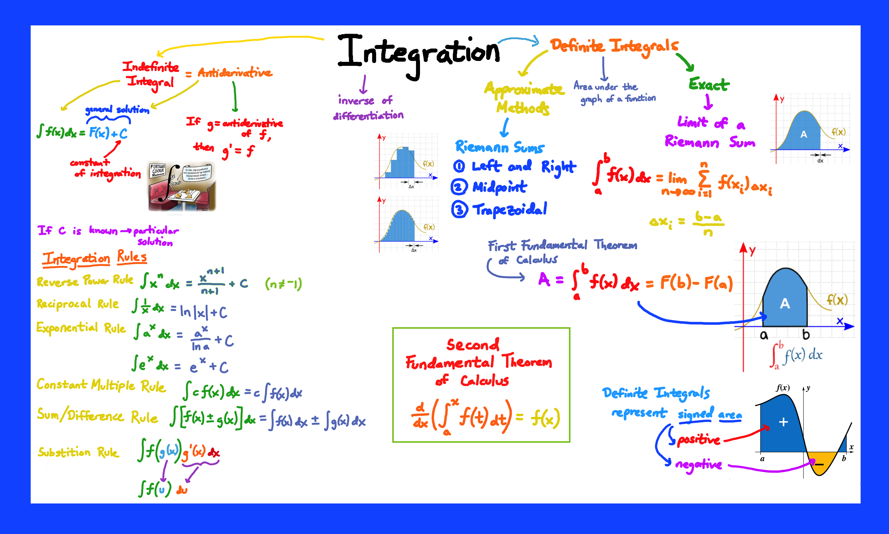

