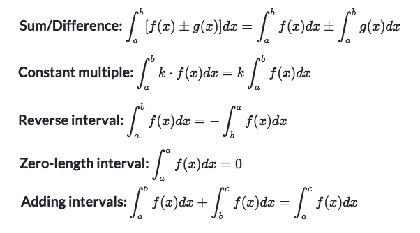
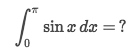
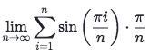
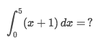
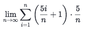
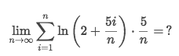
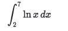
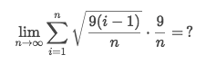
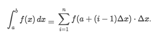
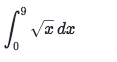

# Definite Integrals

**DEFINITE** means it's `defined`, means both two **boundaries** are **constant numbers**.

## Definite integrals 「properties」

[Refer to Khan academy article: Definite integrals properties review](https://www.khanacademy.org/math/ap-calculus-bc/bc-accumulation-riemann-sums/modal/a/definite-integrals-properties-review)

## 「Definite integral」 ←→ 「Limit of Riemann Sum」

### Example

Solve:
- It's easy to find `Δx = (π-0)/n = π/n`
- And `x𝖎 = S(𝖎) = a + 𝖎·Δx = 0+𝖎·Δx = 𝖎·π/n`
- So the result is:

### Example

Solve:
- Look at the boundaries, it's from `0 -> 5`,
- So the `Δx` must be cut to `n` pieces, whereas `Δx = (5-0)/n = 5/n`
- From the definition, We know the function `f(x) = x+1`
- To fill in the `x𝖎` in `f(x𝖎)`, we need to figure out the sequence:
- Sequence `x𝖎 = S(𝖎) = a+𝖎·Δx`, and since `a` represents the bottom boundary,
- So `x𝖎 = 𝖎(0+Δx) = 𝖎·5/n`
- Get `x𝖎` back in `f(x)` to have:

### Example

Solve:
- We could easily get that the `Δx = 5/n`
- And the function is `f(x) = ln(x)`
- Since the `Δx` comes from Top & Bottom boundaries, 
- So `Δx = (Top - Bottom)/n = 5/n = (Top - 2)/n`,
- And we get the `Top = 7`, and the Definite Integral is:

### Example

Solve:
- See the `i=1` means it's using `Right Riemann Sum`, so the integral would be:

- The `Δx = 9/n` is easily seen.
- And we need to get the Sequence `x𝖎 = S(𝖎) = a + (𝖎-1)·Δx = (𝖎-1)·9/n`
- What we got there above, tells us `a=0`.
- According to that`Δx = (b-a)/n = (b-0)/n = 9/n`, we get `b = 9`
- So the answer is:

