#  ❖ 「U-substitution」 → Chain Rule

> The `u-substitution` is to solve an integral of **composite function**, which is actually to **UNDO** the `Chain Rule`.

[`▶ Back to previous note on: Chain Rule`](https://github.com/solomonxie/solomonxie.github.io/issues/49#issuecomment-390151930)

Compare how we handle the composite functions with derivatives & integrals:
- For taking the **derivative** of a COMPOSITE function, we apply the `Chain rule`.
- For taking the **integral** of a COMPOSITE function, we apply the `u-substitution`.

[Refer to Khan academy: 𝘶-substitution: defining 𝘶](https://www.khanacademy.org/math/ap-calculus-bc/bc-antiderivatives-ftc/modal/v/u-substitution-defining-u)

We use `u-substitution` when we need to integrate an expression of the form of:
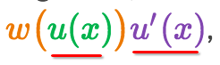

Strategy:
- Find a function as `u`
- Find or **MAKE** an `u'` at the outside so that you can pair `u'` with `dx`
- Replace `u' · dx` with `du`, because `u' = du/dx`
- Rewrite the Integral in term of `u`, and calculate the integral
- Back substitute the function of `u` back to the result.

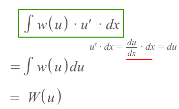

## How to select u

Selecting `u` is the most tricky part here.

### Example
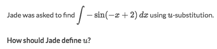
Solve:
- Apparently, we ignore the wrapper `sin()` here.
- We notice that the derivative of `-x+2` is `-1` which we could find it at outside.
- So let `u = -x+2` and `u' = -1`
- So rewrite the integral to `ʃ sin(u) · u' · dx = ʃ sin(u) · du`
- It looks quite neat, so the `u = -x+2` is alright.

### Example
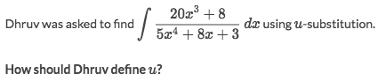
Solve:
- Apparently it's in form of `ʃ u'/u · dx`
- So that we can make `u'·dx = du` and the integral becomes `ʃ 1/u · du`
- Quite nice, so the answer would be out of there.

## How to calculate 「Indefinite Integral」 with u-substitution

### Example
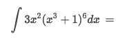
Solve:
- With a real quick eyeballing, we see it's in form of `ʃ u' · u⁶ · dx`
- So with `u' · dx = du` we will get the simplified form `ʃ u⁶ · du = u⁷/7`
- Back substitute function of u back to get the result:
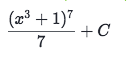

## How to calculate 「Definite Integral」 with u-substitution

### Example
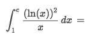
Solve:
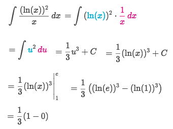

### Example (self-made u')
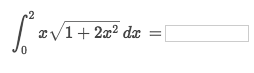
Solve:
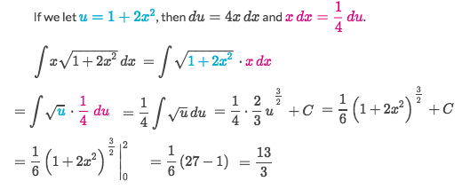

### Example (Inverse Trig Rule)
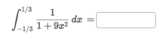
Solve:
- Notice this radical form should directly use the Reversed Inverse Trig Rule:
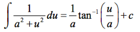
- So that we assume `a = 1 & u = 3x`.
- Since `u' = 3` so we need to make a `3` from nowhere.
- Rewrite the formula to: `1/3 ʃ 3/(1+u²) ·dx = 1/3 ʃ 1/(1+u²) ·du`
- Apply the Reversed Inverse Trig Rule to get: `1/3 arctan(u) + C`
- Back substitute `3x` to `u` and the boundaries back to `x` get the result `π/6`.
