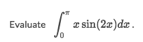
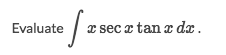
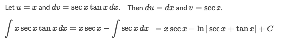

# 「Integrate by Parts」 → Product Rule

> It's the `Reverse Product Rule`. 
And here is the formula to solve the integration by parts: 

[Refer to Khan academy: Integration by parts intro](https://www.khanacademy.org/math/ap-calculus-bc/bc-antiderivatives-ftc/modal/v/deriving-integration-by-parts-formula)

Trick & Strategy:
- Recognize it's an integral with functions' product:
- Carefully choose which function to be `f(x)` and the other to be `g'(x)`.
- Better to choose  the **easier** one as `f(x)` when taking derivative.

### Example

Solve:
[Refer to Symbolab](https://www.symbolab.com/solver/step-by-step/%5Cint_%7B0%7D%5E%7B%5Cpi%7D%20x%5Ccdot%20sin%5Cleft(2x%5Cright)dx)

### Example

Solve:

