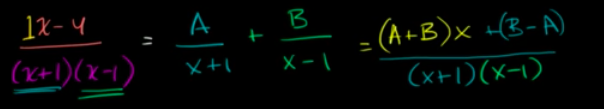
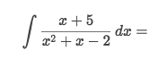
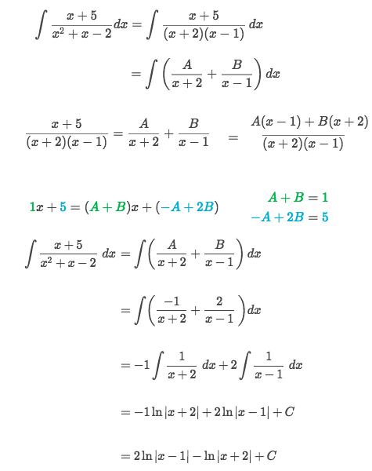
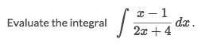
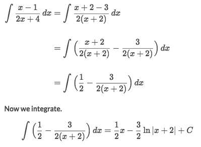

# 「Partial fractions」 → Log Rule

> A technique for integrating `Rational functions`.

[`▶ Jump back to previous note on Partial fractions.`](https://github.com/solomonxie/solomonxie.github.io/issues/44#issuecomment-404754134)

[▶Refer to Khan academy: Partial fraction expansion to evaluate integral](https://www.khanacademy.org/math/ap-calculus-bc/bc-antiderivatives-ftc/modal/v/partial-fraction-expansion-to-integrate)

### Example

This process is to break down the `Rational Function` to some simple fractions, 
which assume there are `A & B`  leads to a system of equation:
- `(A+B)·x + (B-A) = 1·x + (-4)`
- So `(A+B) = 1` and `(B-A) = -4`, which gets us `A = 5/2` & `B = -3/2`

Strategy:
- Look at the `Nominator` & `Dominator`'s degrees.
- If the dominator's degrees are higher or equal than the nominator, we do `Long division of polynomial` to downgrade it.
- Try to **`factorize`** the `dominator` if you can.
    - Assume two variables `A & B`
    - Apply the `Partial Fraction Expansion` technique.
- Apply the basic `Log Rule` to solve the parts.

### Example

Solve:

### Example

Solve:
[Refer to Symbolab.](https://www.symbolab.com/solver/step-by-step/%5Cint%20%5Cfrac%7Bx-1%7D%7B2x%2B4%7Ddx)

