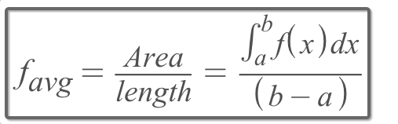
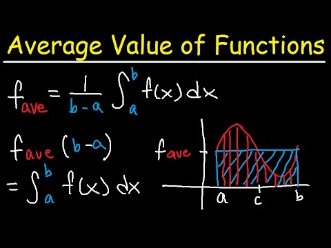
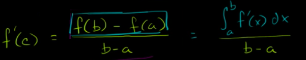

#  ❖ 「Average Value」 of Functions

[Refer to Khan academy: Average value over a closed interval](https://www.khanacademy.org/math/ap-calculus-bc/bc-antiderivatives-ftc/modal/v/average-function-value-closed-interval)
[Refer to video: Average Value of a Function on an Interval](https://www.youtube.com/watch?v=K-H86pxiBlk)

> Calculating `Favg` is just to get the actual area of the function, 
and then "reform" it to a rectangle, 
then divide it by its width, then you get the height.

Strategy:
- Calculate the function's `integral`, which is the `Actual area of the function`
- Calculate the `Interval`, which is the `imaginary rectangle's width`.
- Divide the area by width to get the `Average value of function`, which is the height.

## 「Mean value theorem」 for integrals

> It actually IS the `Average Value of Functions`

