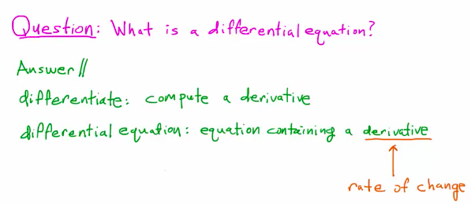
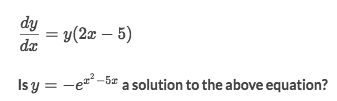
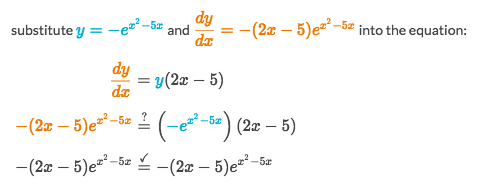
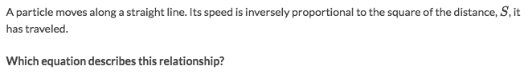
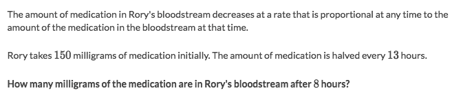

# Differential Equations Intro

### Example

Solve:

### Example

Solve:
- Just for reminder: the `Inversely proportional` means `y = k/x` where `k` is constant. Jump back to previous note: [Proportional Relationship](https://github.com/solomonxie/solomonxie.github.io/issues/44#issuecomment-371403947).
- Assume the function of distance is `S(t) = v · t`.
- So the speed must be the rate of change of **distance**, so the speed is `v = S'(t)`
- Since the speed is inversely proportional to distance's square, so it means `v = S'(t) = k/S²`

### Example

Solve:
- Assume the amount of medication is `M(t)`.
- Now all the informations we have are:
    - `M(0) = 150`
    - `M(13) = 150/2 = 75`
    - `M' = dM/dt = k · M` because they're **Proportional**.
    - The problem is asking `M(8) = ?`.
- So change a bit of `M'` to `1/M · dM = k · dt`.
- Take integral of each side to get `ln(M) = k · t +C`, and further `M = C · eᵏᵗ`
- By introduce the initial condition, we get `M(0) = 150 = C · e⁰ = C`
- By another information, we get `M(13) = 150 · e¹³ᵏ = 75`
- And further, `13k = ln(1/2)`, so `k = ln(0.5)/13`
- And now we get everything of the function `M(t)`, let's solve for `M(8)`
- `M(8) = 150 · e^(8 · ln(0.5)/13) ≃ 97.9  

