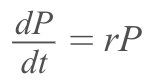
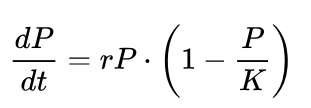
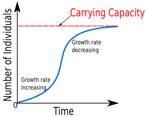
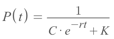
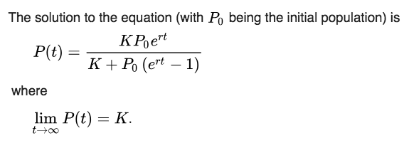
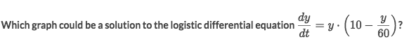
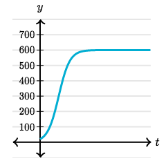
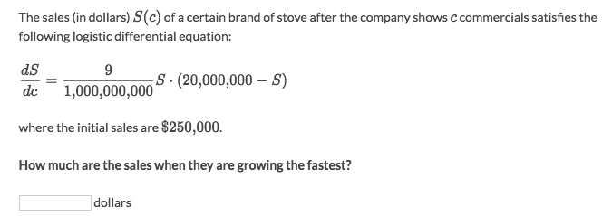

#  ❖ 「Logistic Growth」 Model

`Tags: #LogisticGrowth #LogisticGrowthModel #LogisticEquation #LogisticModel #LogisticRegression`

This is a very famous example of Differential Equation, and has been applied to numerous of real life problems as a model.
It's originally a `Population Model` created by `Verhulst`, as studying the `population's growth`.

Refer to lectures: [▶Khan academy](https://www.youtube.com/watch?v=oiDvNs15tkE), [▶MIT Gilbert Strang's](https://www.youtube.com/watch?v=TCkLSYxx21c), [▶The Organic Chemistry Tutor](https://www.youtube.com/watch?v=JgMvB22XQs0), [▶Krista King](https://www.youtube.com/watch?v=uemhtqZHnak), [▶Bozeman Science](https://www.youtube.com/watch?v=rXlyYFXyfIM)

## 「Intuition」 & 「Origin」 of Logistic Growth Model

Refer to Khan academy: [▶Logistic models & differential equations (Part 1)](https://www.khanacademy.org/math/ap-calculus-bc/bc-diff-equations/modal/v/modeling-population-with-differential-equations)

Let's let `P(t)` as the population's size in term of time `t`, and `dP/dt` represents the Population's growth. 

### 「Malthus'」 Exponential growth theory of population

Mr. Malthus first introduced the exponential growth theory for the population by using a fairly simple equation:

Where `P` is the "Population Size", `t` is the "Time", `r` is the "Growth Rate".

### 「Verhulst's」 Logistic growth theory of population

Mr. Verhulst enhanced the `exponential growth theory of population`, as saying that the population's growth is **NOT ALWAYS** growing, but there is always a certain **LIMIT** or a `Carrying Capacity` to the **exponential growth**.
And combining the `exponential growth` with a `limit`, it's then called the **`Logistic Growth`**.

And the logistic growth got its equation:

Where `P` is the "Population Size" (N is often used instead), `t` is "Time", `r` is the "Growth Rate", `K` is the **"Carrying Capacity"**.
And the **`(1 - P/K)`** determines how close is the Population Size to the Limit `K`, which means as the population gets closer and closer to the limit, the growth gets slower and slower.

> "It explains how density dependent limiting factors eventually decrease the growth rate until a population reaches a Carrying Capacity ( K )."

### 「Carrying Capacity」

Carrying Capacity means the "celling", the "limit", the "asymptote".

### Get the 「Original Population Function」 P(t)

> It's gonna use the method `Separable Equations`, which introduced the `initial condition` as `P₀` in this case.

We could directly solve the Logistic Equation as solving differential equation to get the `antiderivative`:

But we still have a constant `C` in the `antiderivative`, which required us to introduce an `Initial Condition` to get rid of `C` and get the specific function:

## Solving 「Logistic Model」 Problems

### Example

Solve:
- We know the Logistic Equation is `dP/dt = r·P(1-P/K)`.
- So twist the given derivative to the logistic form: `dy/dt = 10·y(1-y/600)`.
- Then we could see the `K = 600`, which is the limit, the Carrying capacity.

### Example

Solve:
- It's asking "growing fastest", means the Max value of Sale's function `S(c)`.
- For the max value of function, we let `S'(c) = dS/dc = 0`
- And we get `S = 0 or 20,000,000`
- So at two points they are getting fastest growing. 
- Yet we have to take the **AVERAGE** of the two points, which is `(0+20,000,000)/2 = 10,000,000`.

