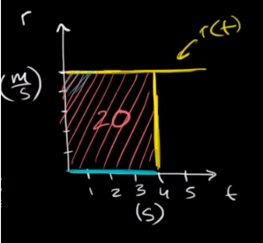
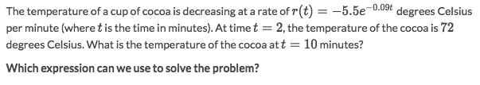
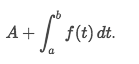
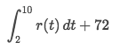
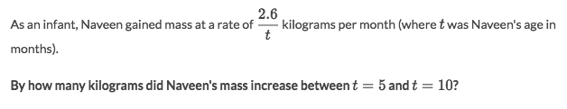
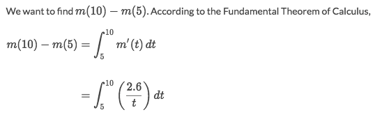
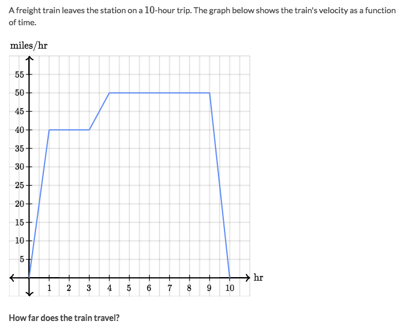
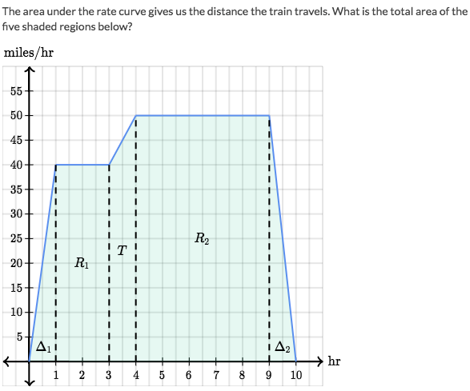

# Area under Rate function

[Refer to Khan academy: Area under rate function gives the net change](Area under rate function gives the net change)

We're used to the function graph that using ordinary `X-Y axes`. But it's also very often we use the `X-R axes` (where Rate of the function as the vertical axis) for real problems.

Assume there's a function of a car's distance: `D(t)`, and the car's speed is represented as a function `r(t)`.
Instead of showing the function graph of `D(t)`, we're showing the Rate function's graph:

Based on the distance formula `Distance  = speed × time`, we could know that `D(t) = r(t) × Δt`
By using a more calculus based term: The distance it traveled in a period of time is `D(t) = ʃ r(t) dt`

So in the graph above, the **AREA** of `rate function` actually means **THE DISTANCE TRAVELED IN A PERIOD OF TIME**, which means:

> **THE DISTANCE IS THE ACCUMULATED SPEED.**

Try to intuitively understand this in mind, then problems will be solved easily.

**Strategy**:
- Imagine the `Rate function graph`.
- Take the conditions of problem into this graph.

### Example

Solve:
- The question is `What is the temperature.` This means we are looking for an **actual value**.
- Actual value is expressed as the **SUM** of an `initial condition` and a `definite integral`:

- So the answer is:

### Example

Solve:

### Example

Solve:

