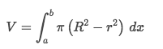
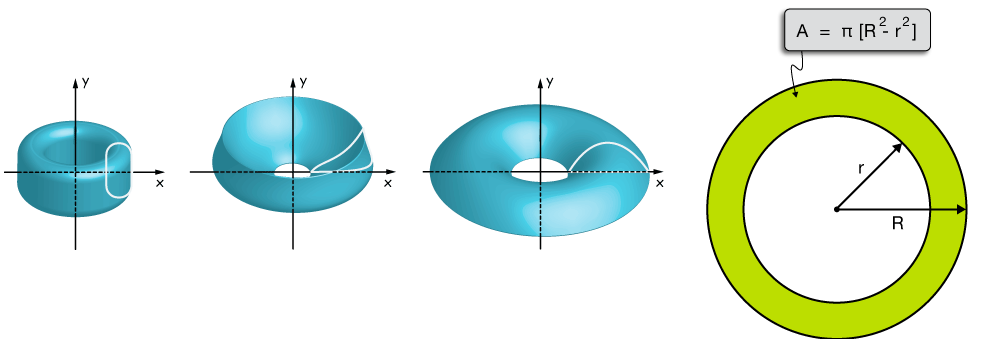
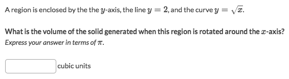
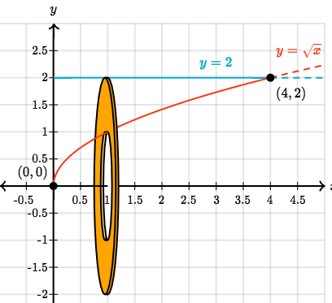
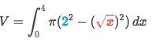

# Washer Method

This method is another kind of `Disc Method`, which works on the `discs` which its centre is **hollow**.

Strategy:
- Simply subtract the hollow disc from the bigger disc `Area = A₁ - A₂`:

- And integrate the disc's area.

[►Jump to Khan academy for some practice: Washer method](https://www.khanacademy.org/math/ap-calculus-bc/bc-applications-definite-integrals/modal/e/the-washer-method)
[▼Refer to the article: The washer method of calculating volumes of revolution](http://xaktly.com/VolumesWasher.html)

### Example

Solve:
- First to graph out the image:

- Subtract hollow disc from bigger disc and integrate them:

