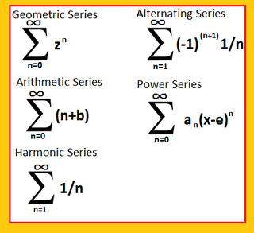
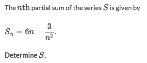
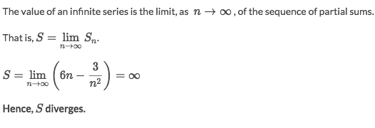
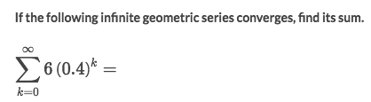
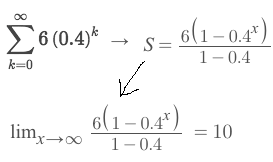

#  ❖ Infinite Seires

## Evaluate 「Infinite Series」 as limit of 「partial sums」
Evaluate the series, is actually to evaluate the **LIMIT** of the `series function`.

### Example

Solve:

### Example

Solve:

