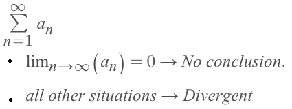
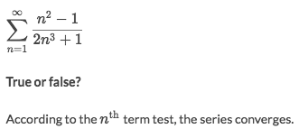

# nth Term Test

> It's also called the `nth term divergence test`.
The test can only tell if the series is divergent or not. It CAN NOT tell if it converges.

[Jump over to Khan academy practice: nth term test](https://www.khanacademy.org/math/ap-calculus-bc/bc-series/modal/e/nth-term-test)
[Refer to Khan academy: nth term divergence test](https://www.khanacademy.org/math/ap-calculus-bc/bc-series/modal/v/divergence-test)

▼Here is the divergent test, very simple:

### Example

Solve:
- Take the limit of the `nth term` we get that the `limit = 0`.
- According to `divergent test` rules, we can't conclude anything about it.
