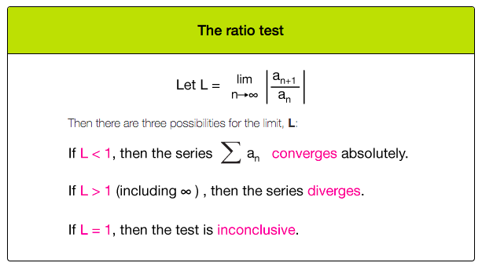
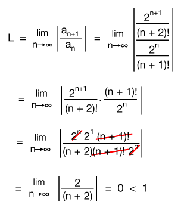
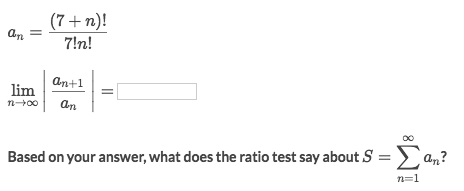
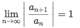

# Ratio Test

**THIS TEST IS GOOD FOR `FACTORIALS`.**

[▼Refer to xaktly: Ratio test / root test](http://www.xaktly.com/RatioTestRootTest.html)

### Example

Solve:
- Apply the `ratio test`:

- `L = 0`, so the series absolutely converges.

### Example

Solve:
- Apply the `ratio test`, let `a_(n+1) / a_n`.
- The trick is to know: `(n+1)! = (n+1)·n!`, and `(n+8)! = (n+8)·(n+7)!`
- Take the limit to get: 

- According to the ratio test, if `L = 1`, then there's no conclusion.
