#  ❖ Error Estimation of Alternating Series

> It's also called the `Remainder Estimation of Alternating Series`.

This is to calculating (approximating) an **Infinite Alternating Series**:
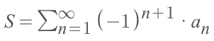

[`►Jump over to Khan academy for practice: Alternating series remainder`](https://www.khanacademy.org/math/ap-calculus-bc/bc-series/modal/e/alternating-series-remainder)

[►Refer to The Organic Chemistry Tutor: Alternate Series Estimation Theorem](https://www.youtube.com/watch?v=FkUrAgBzAZo)
[►Refer to Mathonline: Error Estimation for Approximating Alternating Series](http://mathonline.wikidot.com/error-estimation-for-approximating-alternating-series)
[►Refer to mathwords: Alternating Series Remainder](http://www.mathwords.com/a/alternating_series_remainder.htm)

The logic is:
- First to **test** the series' convergence.
- If the series **CONVERGES**, then we can proceed to calculate it by Error Estimation Theorem. Otherwise we aren't able to.
- We can express the series as the **`sum of partial sums & infinite remainder`**:
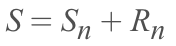
(▲ `Sn` is the **first n terms**, and `Rn` is **from the n+1 term to the rest terms**.)
- And the "structure" in the `partial sum` & `remainder` is:
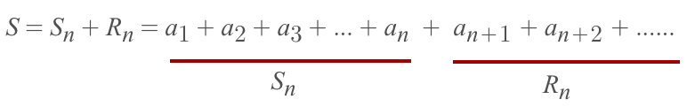
- With a little twist, we will get the whole idea:
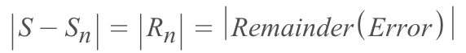
(▲Since the **Rn** is the **gap** between `S & Sn`, so we call it **`The Error`**)
- ▼ And the theorem is: `The Remainder` **MUST NOT** be greater than its **`first term`**:
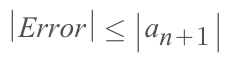

[▼Actual sum = Partial sum + Remainder: refer to Khan academy: Alternating series remainder](https://www.khanacademy.org/math/ap-calculus-bc/bc-series/bc-estimating-inf-series/v/alternating-series-error-estimation)

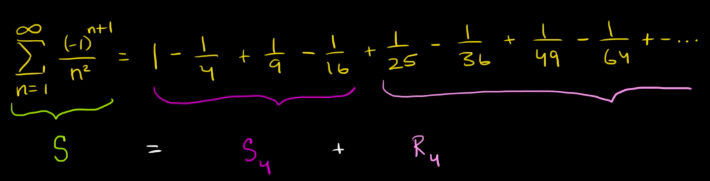

## 「Sign」 & 「Size」 of Error

[►Refer to Khan academy: Alternating series remainder](https://www.khanacademy.org/math/ap-calculus-bc/bc-series/bc-estimating-inf-series/v/alternating-series-error-estimation)
[►Refer to Khan academy: Worked example: alternating series remainder](https://www.khanacademy.org/math/ap-calculus-bc/bc-series/bc-estimating-inf-series/v/alternating-series-remainder)

For the `Remainder series`, its **`FIRST TERM`** is always **DOMINATING** the whole remainder:
- It dominates the remainder's **SIGN**: positive or negative.
- It dominates the remainder's **SIZE**: the whole remainder's absolute value **CAN'T BE** greater than the first term.

Based on the error's **sign**, 
we could tell the approximated series is **UNDERESTIMATED** or **OVERESTIMATED**:
- If `Error > 0`, then the approximated series is **Underestimate**.
- If `Error < 0`, then the approximated series is **Overestimate**.

## Bound the Error (accuracy control)

The `error bound` regards to the **accuracy** of the approximated series, and we want to control the accuracy before approximation.

[►Refer to Khan academy: Worked example: alternating series remainder](https://www.khanacademy.org/math/ap-calculus-bc/bc-series/bc-estimating-inf-series/v/alternating-series-remainder)

We have 2 ways to bound the error in a range:
- Set up **how small** we want the `error` to be, or
- Set up **how many** terms we want to have in the partial sum `Sn`.

### Bound by terms

**The Larger `n` → The smaller gap → The lesser Error → The more accurate.** 

Strategy:
- We could set the `partial sum` to include a certain number of terms, etc. `100 terms`
- And the **first term** of Remainder should be the `101st term`.
- The `error bound`, or the `error` is **dominated** by the **first term.**
- So we say the `error bound` IS the value of the `101st term`.

### Bound the error

To bound the error in a range, we often say:
- "Approximate the series to the **2 decimal places**",
- "Let the error be **less than 0.01**",
- "We want the accuracy within ±0.01"

What they mean are the same:
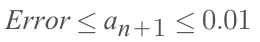

▲ And by solving the inequality, 
we will get the scope for `n`, 
then get the **`Smallest Integer of n`** in that scope.

### Example
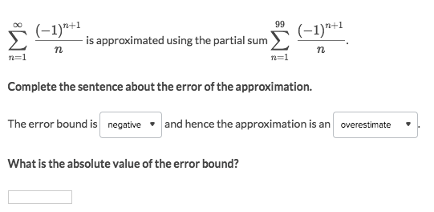
Solve:
- First to notice, the `partial sum` is already set to `100` terms, so we're to **control accuracy** by `bound the terms`.
- So the `error` should be from the `101st term` to infinity.
- But the `error bound` is actually dominated by the first term of the error.
- So the `error bound  = the value of 101st term`:
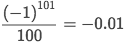
- We could say that: The `error bound` is **negative**, and negative error causes **overestimation**.

### Example
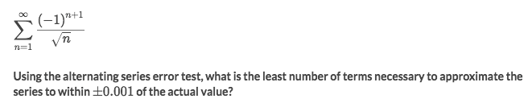
Solve:
- It's clear this is a `alternating series`.
- So we want to do the `alternating series test` first, and it passed, which means it converges.
- Since the series converges, we can do further approximation.
- See that we don't know how many terms are in the `partial sum`, and only know how much accurate we'd like.
- So we're to approximate by `bound the error`, and find out the terms.
- Apply the `Error Approximation Theorem`, assume the **first term of remainder** is `a_(n+1)`:
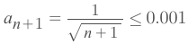
- Solve out the inequality to get `n ≥ 999,999`
- And `999,999` the smallest integer of `n` to make the series converges with 2 decimal accuracy.

