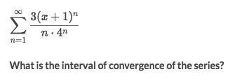
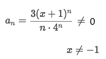
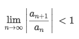
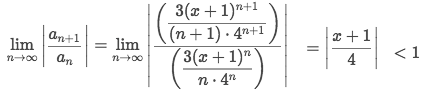
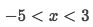
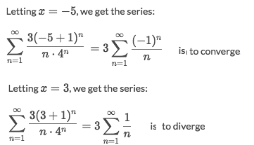
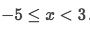

#  ❖ Interval of Convergence

When we see the series as a function, we can actually specify an interval for the function so that the series certainly converges over this interval.

[`►Jump over to have practice at Khan academy: Interval of convergence`](https://www.khanacademy.org/math/ap-calculus-bc/bc-series/modal/e/find-interval-of-convergence)

The method is kind of like finding the interval of an ordinary function:
- The `term` of series **can't** be `0`, so set `a_n ≠ 0` and solve  it to get the condition.
- Take some `convergence tests`, etc. `ratio test`.
- Calculate to get the condition that makes the **test** passes.
- Substitute the `endpoints` of the interval back in the function and see if it also converges.

### Example

Solve:
- The term **can't be** zero, so:

- And further more, take a `ratio test` which makes it converges:

- Calculate the `ratio test` to get the interval:

- Get the interval for `x`:

- Test the `endpoints` for this interval:

- In conclusion, the `interval of convergence` is:

