#  ❖ Maclaurin Series

> It's also called `Maclaurin polynomials`.

`Maclaurin series` is a special case of `Taylor Series` which centres at `x=0`.

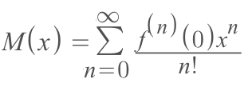

▼Expand it we'll understand it better:
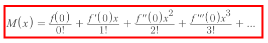

▼Here is a graph we're trying to approximate a function centred at `x=0`:
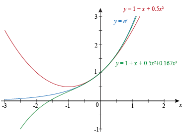

### Example
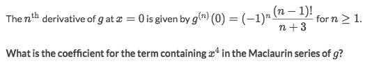
Solve:
- This problem is to test if you're familiar with the `Maclaurin Series Formula`.
- Let's ignore all others and only see the asked `x⁴`.
- `x⁴` means we're gonna find out the term of the `4th derivative`, and plug in 4 into the formula, we'll get the term:
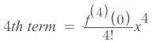
- It's asking for the coefficient of `x⁴`, which is the rest part in that formula for the term:
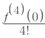
- And we only need to find out what is the value of the `4th derivative`.
- By the given formula of `gᴺ(0)`, we can get: 
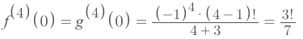
- So the coefficient will be:
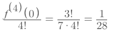

### Example
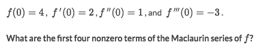
Solve:
- We know the `Maclaurin series` is a Taylor series centred at `x=0`, and the formula is:
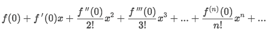
- It's told to list 4 terms, so we plug in the given value of `f', f'', f'''`  and get:
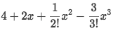
- And we get the answer:
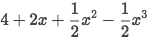

## Evaluate 「Maclaurin Series」

To evaluate a Maclaurin series, we need to **convert the series to a function**,  and then evaluate the function.

[`▼Jump forward to have a look at the note: Maclaurin Series of Common functions`](https://github.com/solomonxie/solomonxie.github.io/issues/49#issuecomment-402940122)

