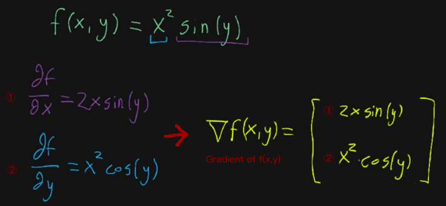
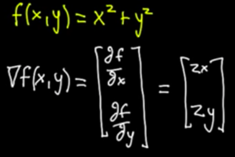

# Gradient [DRAFT]

Now we take many `partial derivatives` out from a function, and we need to **pack them together** in a form.
We call the form of pack `The gradient of the function`.

For example:

