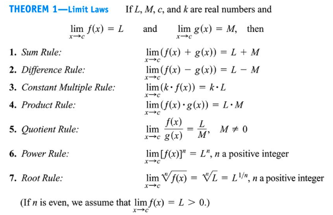
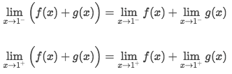
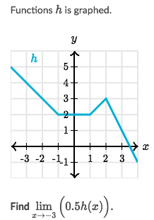
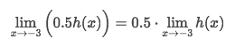
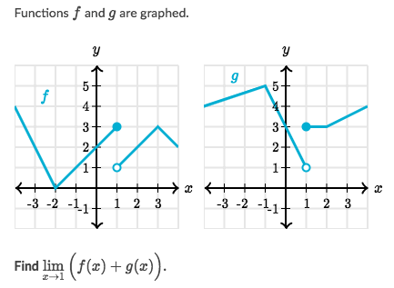
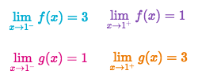
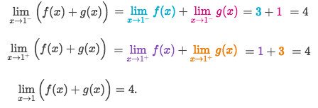

# 「Limits」 properties

[Refer to Khan academy: Limit properties](https://www.khanacademy.org/math/ap-calculus-ab/ab-limits-new/ab-1-5a/v/limit-properties)

**The limit of a SUM of functions is the SUM of the INDIVIDUAL limits**:

## Limits of 「Combined Functions」

[Refer to Khan academy: Limits of combined functions](https://www.khanacademy.org/math/ap-calculus-ab/ab-limits-new/ab-1-5a/v/limits-of-combined-functions)

### Example

Solve:

### Example

Solve:
- The limit for each function DOES NOT exists.
- However, the `one-side limits` of each graph DO exist

- We can use the fact that **the limit of a sum of functions is the sum of the individual limits**:

- Calculate each side's combined limits:

