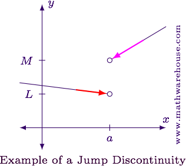
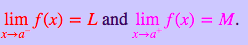
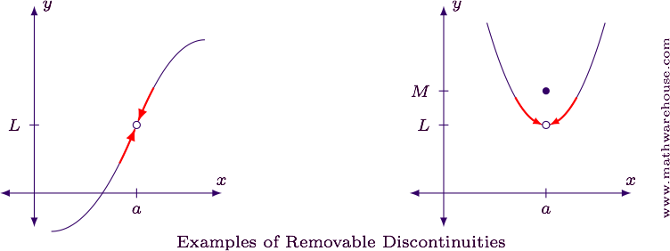
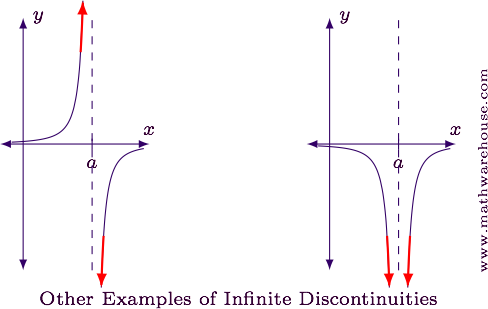
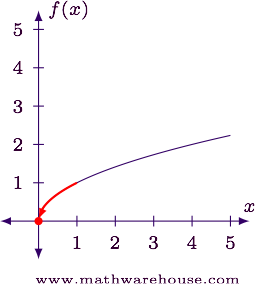
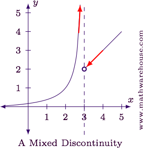

#  ❖ All types of discontinuities

[Refer to Mathwarehouse: What are the types of Discontinuities?](http://www.mathwarehouse.com/calculus/continuity/what-are-types-of-discontinuities.php)

## 「Jump Discontinuities」

> A `Jump discontinuity` occurs at some point, the `left side limit` is DIFFERNT with the `right side limit`.

We see that clearly:

## 「Removable Discontinuities」

> A `removable discontinuity` occurs at some point, both `left side limit` & `right side limit` are the SAME.

## 「Infinite Discontinuities」

> An `Infinite Discontinuity` occurs  at some point, both `left side` & `right side` are approaching to INFINITY, which means both sides DO NOT have limits.

## 「Endpoint Discontinuities」

> An `Endpoint Discontinuity` occurs at some point, it DOESN'T HAVE **both** sides, it only has ONE SIDE.

## 「Mixed Discontinuities」

