#  ❖ 「Derivative」 Basics

> Simply saying, it's just the SLOPE of ONE POINT of a graph (line or curves or anything).

[Refer to Mathsisfun: Introduction to Derivatives](https://www.mathsisfun.com/calculus/derivatives-introduction.html)

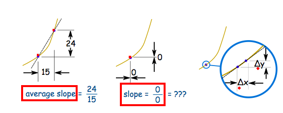

A Derivative, is the `Instantaneous Rate of Change`, which's related to the `tangent line` of a point, instead of a secant line to calculate the Average rate of change.

“Derivatives are the result of performing a differentiation process upon a function or an expression. ”

## Derivative notations

[Refer to Khan academy article: Derivative notation review.](https://www.khanacademy.org/math/ap-calculus-ab/ab-derivative-intro/modal/a/derivative-notation-review)

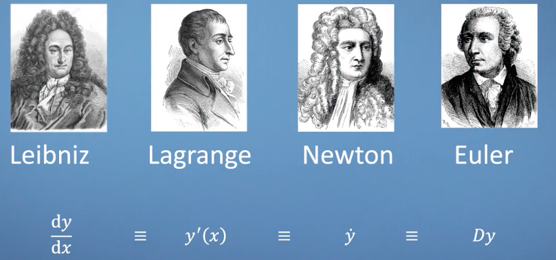

### 「Lagrange's」 notation

In Lagrange's notation, the derivative of `f(x)` expressed as `f'(x)`, reads as `f prime of x`.

### 「Leibniz's」 notation
In this form, we write `dx` instead of `Δx heads towards 0`.
And `the derivative of` is commonly written as: 
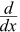

> For memorizing, just see `d` as `Δ`, reads `Delta`, means change. So `dy/dx` means `Δy/Δx`. Or it can be represent as `df / dx` or `d/dx · f(x)`, whatever.

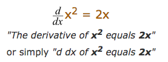

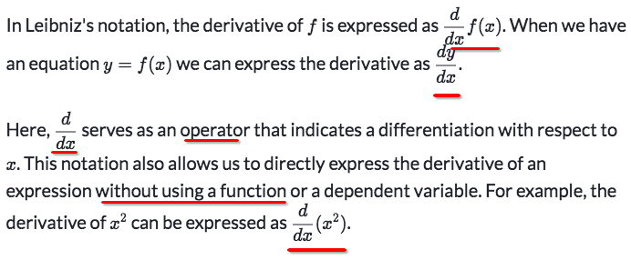

## How to understand 「dy/dx」

[Refer to Khan academy from Differential Equation section: Addressing treating differentials algebraically](https://www.khanacademy.org/math/ap-calculus-bc/bc-diff-equations/modal/v/addressing-treating-differentials-algebraically)

This is a review from "the future", which means while studying Calculus, you have to come back constantly to review what the `dy/dx` means.  ---- It's just so confusing.
Without fully understanding the `dy/dx`, you will be lost at topics like `Differentiate Implicit functions`, `Related Rates`, `Differential Equations` and such.

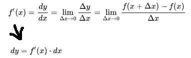

## 「Tangent line」 & 「Secant line」

- The `secant line` is drawn to connect TWO POINTS, and gets us the `Average Rate of Change` between two points.
- The `Tangent line` is drawn through ONE POINT, and gets us the `Rage of change at the exact moment`.

As for the `secant line`, its interval gets smaller and smaller and APPROACHING to `0` distance, it actually is a process of calculating `limits` approaching `0`, which will get us the `tangent line`, that been said, is the whole business we're talking about: the `Derivative`, the `Instantaneous Rate of Change`.

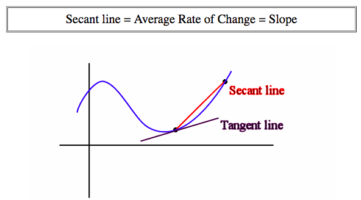

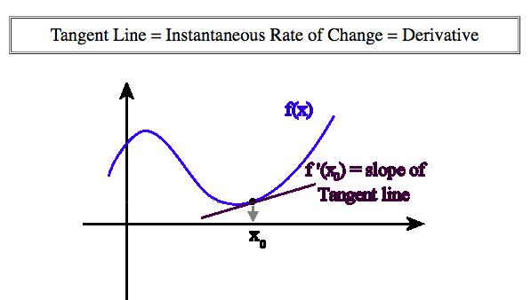

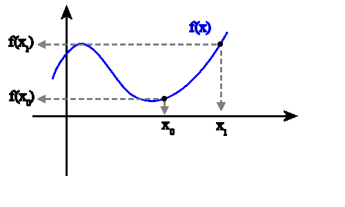

## 「Secant line」

### Example
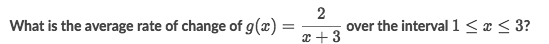
Solve:
- What it's asking is the `Slope of its secant line`:
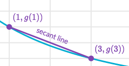
- which could be applied with this simple formula:
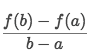
- the result is `( f(3)-f(1) )/ (3-1) = -1/12`
